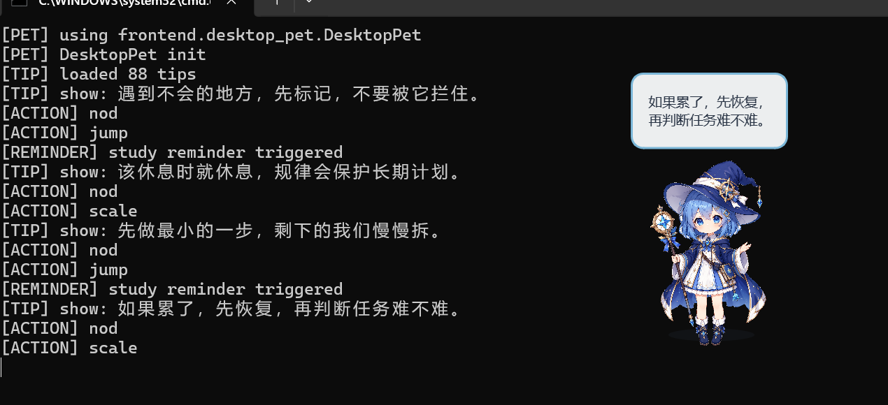

# RoxyPlan

RoxyPlan 是一个基于 Python 和 PySide6 实现的桌面成长伙伴原型，围绕学习提醒、桌面陪伴、情绪支持、本地成长记录和本地大模型调用进行验证。

当前核心版本为 **V1.8 可靠交互闭环原型**。桌面端和 Web 端继续共用 `ConversationService`；自然语言动作统一经过交互状态协调、语义候选、真实业务对象解析、安全工具执行和确定性回复。记忆、计划与行动记录沿用现有 Manager、Repository 和本地 JSON，不由模型直接修改。在此基础上保留可选 DeepSeek、原生 Tool Calling 与本地 Ollama 降级。它仍是本地原型，没有公网部署、账号或数据库，也不能任意操作电脑。

当前完成度总览见：[docs/current_status.md](docs/current_status.md)。
V1.6 手动验收清单见：[docs/v1_6_acceptance.md](docs/v1_6_acceptance.md)。V1.5 发布前工程边界仍记录在：[docs/release_v1_5.md](docs/release_v1_5.md)。
V1.7 配置与验收见：[docs/deepseek_provider.md](docs/deepseek_provider.md) 和 [docs/manual_acceptance_deepseek.md](docs/manual_acceptance_deepseek.md)。
Provider-neutral 工具协议见：[docs/agent_tool_call_protocol.md](docs/agent_tool_call_protocol.md)，手动验收见：[docs/manual_acceptance_v16.md](docs/manual_acceptance_v16.md)。
V1.8 状态机、语义协议与验收见：[docs/interaction_state_machine.md](docs/interaction_state_machine.md)、[docs/semantic_action_protocol.md](docs/semantic_action_protocol.md) 和 [docs/manual_acceptance_v18.md](docs/manual_acceptance_v18.md)。

## 项目截图



## 技术栈

- Python
- PySide6
- JSON 本地配置
- Ollama / Qwen 本地模型调用尝试
- Git / GitHub
- AI 辅助开发与调试
- FastAPI / Uvicorn（仅 Local Web 局域网适配层）
- DeepSeek OpenAI-compatible API（可选在线 Provider）

## 已实现功能

- V1.8 单一交互链：`InteractionStateCoordinator -> LocalFeatureExtractor -> SemanticActionParser -> BusinessResolver -> ToolExecutor -> ResponseComposer`
- “确认、取消、第二个、就这个”等控制表达优先消费当前会话的待处理状态，不交给普通模型重新猜测
- 语义模型只提出不可信 `ActionCandidate`；计划、记忆和候选的真实 ID 始终由本地业务服务解析与校验
- 计划、行动记录和记忆候选使用同一套明确命令、模糊澄清、对象选择与真实结果回复方式
- `ActionBatch` 单轮最多顺序执行 3 个动作，支持依赖跳过、独立动作继续和 `partial_success`
- `ResponseComposer` 与 `ActionClaimGuard` 要求修改成功和空数据声明均有匹配的真实 `ToolResult`
- V1.8 五个回滚开关默认启用，不迁移或破坏现有本地数据

- 桌面角色显示与透明背景图片加载
- 轻量聊天窗口与中英文文本输入
- 本地提示语系统，当前包含 88 条提示语
- 独立角色人格配置
- 桌宠气泡提示
- 点击触发 `jump` 动作
- 气泡触发 `nod` 动作
- 思考状态 `thinking / shake`
- 学习提醒 `study reminder / scale`
- 睡眠状态 `sleep` 与点击唤醒 `wake`
- QThread / Worker 避免模型回复时阻塞 Qt 主线程
- 统一 LLM Provider 层，DeepSeek 与 Ollama 响应转换为项目内部契约
- 省钱 / 自动 / 高质量三种集中模型路由模式，模型名称只在配置层维护
- DeepSeek 原生 Tool Calling 只负责提出工具与参数，真实执行仍经过 ToolRegistry、SafetyPolicy、ConfirmationManager 和 ToolExecutor
- `ModelActionAdapter` 将原生 `tool_calls` 与受限 JSON fallback 统一为不可信 `ProposedAction`，不直接执行工具
- 工具参数最多修复一次，单轮最多两次模型回环和三次工具调用；共享数据写入保持串行
- `ReferenceResolver` 仅用当前会话结构化工具结果解析“刚才那个/上一个计划”，多个候选时主动澄清
- 确认绑定不可变参数、会话、调用 ID 和目标状态指纹，目标变化后必须重新发起确认
- `ActionClaimGuard` 阻止没有成功 `ToolResult` 的“已添加/已保存/已完成”声明
- DeepSeek 缺少 Key、网络失败或服务异常时可降级为 Ollama 普通聊天；Ollama 不接管模糊或高风险写工具
- DeepSeek API Key 只从环境变量或 `data/private/llm_secrets.json` 读取，不进入公开配置和聊天历史
- 本地模型用量只记录 Provider、模型、token、延迟、成功状态、工具数和路由原因，不保存 prompt
- `memory.example.json` 示例记忆文件与本地私有 `memory.json`
- 智能记忆候选：识别稳定偏好、长期目标、习惯和项目边界，确认后才写入长期记忆
- 普通聊天只从用户明确表达中生成高价值候选，不从模型回复推断用户信息
- 健康、心理、家庭和身份等敏感信息默认不生成候选；明确要求记住后仍需人工确认
- 显式“记住”不再直接写长期记忆，而是进入与普通候选相同的审核流程
- 记忆候选面板，可查看来源与分类并确认或忽略候选
- `MemoryManager` 兼容旧 `memory.json`，升级结构前先在私有目录创建备份
- 长期记忆支持分类、重要度、标签、使用次数、最近使用时间和归档状态
- `MemoryRetriever` 使用类别优先级、关键词、多词组合、文本相似度、重要度、置信度和最近使用时间排序相关记忆
- “你认识我吗”“你了解我什么”等开放表达由确定性记忆查询处理，不再交给模型猜测
- 普通聊天最多注入 5 条相关记忆，明确询问记忆时最多读取 8 条
- “学习”“模型”“任务”等泛化词不能单独命中某一条具体记忆，检索还需要当前主题的文本证据
- 高相似记忆不会重复保存，明显冲突进入私有冲突列表等待用户处理
- 冲突支持保留旧、使用新、人工合并、两条都保留和暂不处理
- 修改、归档、恢复、候选审核与冲突决策写入私有 `memory_audit.json` 审计记录
- Web 审计接口只返回操作元数据和正文长度，不返回完整记忆正文
- 记忆管理面板统一管理长期记忆、待确认记忆、冲突和已归档记忆
- `MemoryService` 统一桌面面板、聊天 Agent 和 Local Web 的记忆业务入口，并复用同一个 Repository 与数据路径
- 记忆数据查询不会落入普通模型猜测；候选列表会在当前会话中保存真实 ID，支持“第二个”“这两个”“全部”等审核指代
- 自然语言意图理解：计划、记录、复盘、记忆查询等表达可走统一安全路由
- 新兴趣、缺少主题的安排请求和引用上一条回复的记忆请求会先识别真实操作边界，信息不足时只追问必要内容
- 固定命令保持优先；规则不确定时才可选用当前兼容模型辅助解析，失败会回退本地规则
- 可选模型意图层只返回经过枚举、参数和风险复核的结构化 `IntentResult`，不直接执行函数
- 桌面端的模型意图兜底与普通回复都在现有 QThread Worker 中运行，避免阻塞 Qt 主线程
- 当前问题相关性过滤，避免旧健康等敏感话题干扰无关学习或编程回答
- 会话级敏感话题抑制不会删除长期记忆；用户再次明确询问时可按当前问题临时使用
- 记忆支持 `current_state`、稳定身份、历史状态、未来意向、偏好、临时状态和约束等兼容作用域
- 设置面板可配置智能意图、模型意图辅助、自动执行置信度和最近上下文数量
- `AgentCore` 统一协调意图、受限规划、安全检查、工具执行和自然结果汇报
- 工具统一返回 `success / status / message_code / display_message / data / error`；只有通过执行及结果校验后才使用完成式回复
- `ConversationService` 统一编排桌面端与 Local Web 的意图、Agent、相关记忆、会话上下文和普通 LLM 聊天
- `ToolRegistry` 仅注册计划、成长、记忆、提醒和桌宠动作等现有内部能力
- 单次请求最多执行 3 个步骤；前一步失败时，依赖步骤不会继续
- 删除、归档、恢复和清空类操作绑定具体参数并要求短时二次确认
- 可选模型规划只接受受限 JSON，失败后回退本地规则；模型不能直接调用 Manager
- 当前 Agent 不提供 Shell、CMD、PowerShell、任意文件读写或任意电脑控制
- `modules/contracts.py` 统一定义带版本号的意图、工具结果、Agent 响应、确认和客户端动作契约
- Growth、Memory、MemoryCandidate、ChatHistory Manager 已通过 Repository 接口使用现有 Local JSON 数据
- 新任务、记忆和候选使用稳定字符串 `uid`，原整数序号继续兼容聊天命令和界面显示
- 客户端动作仅允许 `nod`、`jump`、`show_bubble`、`play_dance`、`sleep`、`wake`、`scale`
- Local Web V0.1：手机适配的聊天、今日计划、行动记录、成长日志、长期记忆和会话记录页面
- Local Web API 支持仅本机访问或通过 `ROXY_LOCAL_TOKEN` 保护局域网请求
- Local Web 普通聊天复用现有人格 JSON、`MemoryRetriever` 和 `ContextBuilder`，只注入当前问题相关记忆
- 桌面端和 Web 端通过共享 `KnowledgeManager` 读取 `.txt` / `.md`，只注入匹配当前问题的有限知识片段
- Local Web 的长期记忆查询由现有 AgentCore 确定性返回，不交给模型自由回答
- Local Web 使用稳定 `conversation_id` 保存本地最近消息与会话摘要，刷新页面后仍可延续同一会话
- 本地 JSON 使用唯一临时文件、`flush`、`fsync`、原子替换和轻量文件锁，降低桌面/Web 同时写入时的覆盖与损坏风险
- Local Web 提供确定性的计划增删完成、行动记录、今日复盘和成长日志 API，写操作继续经过现有工具安全层
- Local Web 长期记忆区包含待审核候选、冲突和审计视图，页面操作不经过 LLM
- Web 会话支持新建、恢复和修改显示标题；桌面会话不会出现在 Web 会话列表中
- 运行状态页可独立显示 Web、Ollama、当前模型和知识文件数量，模型离线不会拖垮页面
- `data/knowledge/` 本地知识库，支持读取 `.txt` / `.md`
- 聊天时基于用户问题轻量匹配本地知识片段并加入 prompt
- 多帧舞蹈素材播放框架，支持 `assets/pet/dance/dance_*.png`
- 设置面板，可调整提醒、睡眠、缩放、置顶、桌宠图片路径和模型名
- 公开仓库体检脚本，辅助检查隐私文件和临时文件误提交
- 今日计划、行动记录、今日复盘与本地成长日志
- 浅色成长面板，支持计划增删完成、行动记录和复盘保存
- `GrowthManager` 统一管理按日期隔离的私有成长数据
- `IntentRouter` 使用固定命令、本地语义规则和可选 LLM 结构化兜底三层识别；任何模型输出都要经过白名单校验
- 支持自然表达添加/完成计划、记录行动、触发复盘和显式保存长期记忆
- 计划完成支持文本包含关系与 `SequenceMatcher` 模糊匹配，结果不明确时请求用户确认
- 今日计划支持更新标题、日期、时间段、时长、优先级和备注，并支持改期、重开和取消
- 相似计划不会静默重复添加；用户可选择更新原计划、明确保留两条或取消
- 当天成长日志重复保存会更新同一条记录及 `updated_at / revision`，不会阻塞下午继续添加计划和行动
- `ProactiveManager` 根据今日计划、行动记录、完成情况和时间生成轻量主动提醒
- 支持未完成计划、无行动记录、晚间复盘、完成鼓励和长时间未互动五类提醒
- 主动提醒包含全局/同类型冷却、近期互动保护、晚间每日一次和 dance 避让
- 设置面板可控制主动陪伴、提醒间隔、晚间复盘提醒和未互动提醒
- 本地多会话聊天历史，可恢复最近对话、新建、切换和删除会话
- 超长会话使用独立摘要压缩上下文，不会自动写入长期记忆
- `ContextBuilder` 只注入会话摘要、最近指定数量消息和相关知识片段
- 聊天窗口提供“新对话”“历史”入口，设置面板可控制保存、恢复和摘要
- `roxy.bat` 一键启动
- 基础测试脚本

## 项目结构

```text
RoxyPlan/
├─ assets/      # 桌宠图片资源
├─ data/        # 提示语、人格、桌宠配置与本地知识库目录
├─ docs/        # 产品、架构和路线文档
├─ frontend/    # 桌宠窗口、聊天界面和动作控制
├─ modules/     # Agent、契约、业务 Manager 与可复用模块
│  └─ repositories/ # 持久化接口及当前 Local JSON 适配器
├─ server/      # Local Web FastAPI 适配层与轻量静态页面
└─ tests/       # 基础测试脚本
```

## Windows 运行方式

1. 创建并激活 Python 虚拟环境。
2. 安装依赖：

```powershell
pip install -r requirements.txt
```

3. 使用启动脚本：

```powershell
.\roxy.bat
```

也可以直接运行：

```powershell
.\.venv\Scripts\python.exe -u frontend\pet_app.py
```

本地模型聊天属于可选能力，需要用户自行准备本地 Ollama 服务与兼容模型。DeepSeek 在线能力也完全可选；没有 API Key 时程序不会崩溃，会继续尝试本地 Ollama。

### DeepSeek 在线模型（可选）

方式一，在 PowerShell 中设置环境变量后重新打开终端：

```powershell
setx DEEPSEEK_API_KEY "你自己的Key"
```

方式二，在桌面端打开“设置”，在“在线模型服务”中填写 Key、保存并测试连接。请不要把真实 Key 发到聊天、Issue 或提交记录里。Key 优先级为环境变量，其次是 Git 忽略的 `data/private/llm_secrets.json`。当前集中默认值为 `deepseek-v4-flash` 和 `deepseek-v4-pro`，可在高级设置中修改，以便官方模型名称变化时无需改业务代码。

### Local Web V0.1

安装局域网页面依赖：

```powershell
.\.venv\Scripts\python.exe -m pip install -r server\requirements.txt
```

启动：

```powershell
.\run_roxy_web.bat
```

本机打开 `http://127.0.0.1:8000`。手机访问前必须在同一 CMD 中设置 `ROXY_LOCAL_TOKEN`，并使用电脑局域网 IPv4 加 `:8000`。网页 Token 只保存在当前标签页的 `sessionStorage`。完整边界和操作见 [docs/local_web_v0_1.md](docs/local_web_v0_1.md)。程序不会自动修改 Windows 防火墙。

## 本地记忆、知识库与成长数据

- `memory.example.json` 是公开仓库中的示例记忆结构。
- `memory.json` 是本地私人文件，程序首次启动且找不到该文件时，会根据 `memory.example.json` 自动创建。
- `memory.json` 已加入 `.gitignore`，不建议提交到 GitHub。
- `data/private/memory_candidates.json` 保存待确认记忆及其状态，整个目录已被 Git 忽略。
- `data/private/chat_history.json` 保存本地会话与消息，`chat_summaries.json` 保存会话摘要。
- `data/private/memory_conflicts.json` 保存尚未处理的记忆冲突。
- `data/private/memory_audit.json` 保存最小记忆治理审计，记录动作、目标、变更前后内容、时间和来源。
- `data/private/backups/` 保存旧记忆结构迁移前的本地备份。
- 会话摘要只用于当前聊天的上下文压缩，不会自动进入 `memory.json`。
- 明确说“记住：……”或“帮我记住……”也只进入候选列表，不会绕过人工审核。
- 候选只有在用户说“确认记忆1”或在面板点击确认后才会写入 `memory.json`。
- 本地知识文件放在 `data/knowledge/`，支持 `.txt` 和 `.md`。
- `data/knowledge/` 中的实际知识文件默认不提交，只保留目录说明文件。
- 私有成长数据统一放在 `data/private/`。
- `data/private/today_plan.json` 保存按日期隔离的计划。
- `data/private/action_log.json` 保存行动记录，`data/private/growth_log.json` 保存每日复盘。
- `data/private/` 已整体加入 `.gitignore`，不建议提交任何计划或复盘内容。
- 首次升级时会安全导入旧 `data/*.json` 成长数据，旧文件不会被自动删除。

今日计划命令示例：

```text
添加计划：学习机器学习30分钟
查看计划
完成计划1
删除计划1
我完成了学习机器学习30分钟
记录：今天学习了逻辑回归
查看记录
今日复盘
保存今日复盘
查看成长日志
```

V1.0 自然表达示例：

```text
我今天想学半小时机器学习
帮我安排一下今天：学机器学习、测试洛琪希
刚才把 RoxyPlan 文档整理完了
今天推进了舞蹈模块
今天状态怎么样
保存今天的复盘
以后你要记得我不喜欢熬夜
先别提醒我
恢复提醒
我喜欢晚上学习
查看待确认记忆
查看待审核记忆
确认记忆1
确认候选1
忽略记忆1
忽略候选1
新建对话
查看历史对话
切换对话1
删除对话1
总结这段对话
查看长期记忆
查看项目记忆
搜索记忆：机器学习
归档记忆1
恢复记忆1
查看记忆冲突
整理记忆
```

固定命令仍然保留并优先处理；未匹配到成长或记忆意图的内容会继续进入普通聊天。

提交公开仓库前可以运行：

```powershell
.\.venv\Scripts\python.exe tests\check_public_repo.py
.\.venv\Scripts\python.exe tests\test_release_readiness.py
```

## 项目亮点

- 从静态聊天窗口逐步演进为带状态系统的桌宠原型
- 将提示语、人格和桌宠设置拆分为独立 JSON 数据
- 将私人记忆与公开示例记忆分离，降低误提交隐私数据的风险
- 使用轻量关键词匹配读取本地知识文件，无需向量数据库即可验证知识增强聊天
- 使用 QThread / Worker 保持模型请求期间的界面响应
- 已形成点击、气泡、思考、提醒、睡眠与唤醒的基础交互闭环
- 通过聊天命令和成长面板形成“计划 -> 行动 -> 复盘 -> 保存”的最小成长闭环
- 通过纯规则意图路由补充固定命令，成长操作无需额外模型调用
- 对计划名称做轻量模糊匹配，匹配不明确时不会直接修改数据
- 保持桌面端轻量实现，便于持续验证交互体验

## 当前阶段

V1.7 在既有 Agent Core、Repository 和智能记忆能力上，增加可选在线模型与本地降级，同时保持“理解 → 澄清/确认 → 执行 → 校验 → 回复”的事实链路。Local Web 继续使用本地 JSON 和同一套 ConversationService，可在可信局域网内试用；尚未创建公网 RoxyPlan-Web、云数据库、账号或跨设备同步。

确定性计划、记忆和成长操作不依赖模型自由发挥；普通聊天的知识深度和语言质量仍受本地模型能力影响。当前提示约束要求先回答实际问题，不把无关对话强行改写成计划、编程练习或健康建议。

当前成长闭环已进入可试用验收状态，固定命令、自然语言入口和成长面板共用同一套本地私有数据。

更具体地说，现在已经完成了“桌宠入口 + 多会话聊天窗口 + 显式本地记忆 + 规则人格 + 设置面板 + 轻量知识读取 + 本地成长闭环 + 局域网移动控制台 + 本地模型调用实验”的原型组合；尚未完成公网部署、数据库持久化、长期趋势分析、周报月报、语音、复杂文档解析、向量检索、原生移动端和跨端同步。

## 计划中

- 持续优化聊天界面与展示效果
- 增强长期记忆规则、检索策略和隐私边界
- 改进本地知识文件读取与内容召回质量
- 增强成长日志检索，并探索周报/月报
- 加入更自然的动作表现
- 探索 Live2D、多帧动画和骨骼动画
- 继续优化局域网移动控制台的操作反馈与安全边界

版本变更记录见：[docs/CHANGELOG.md](docs/CHANGELOG.md)。

## 隐私说明

本项目包含本地运行数据和模型连接设置。公开仓库提交前，应确认 `memory.json`、`data/private/`、私人聊天记录、密钥、本地模型设置和临时测试文件均未被纳入版本控制。
