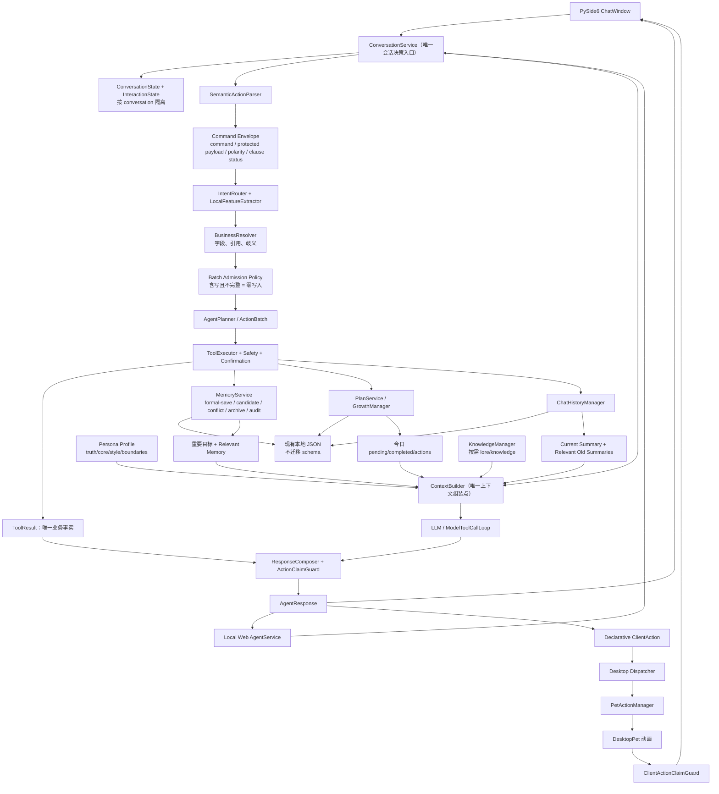

# RoxyPlan 人格、记忆与连续性实施前架构评审

> 审计日期：2026-07-29
> 审计性质：只读源码审计、只读诊断、实施方案设计
> 适用基线：当前 `main` 工作区（包含尚未提交的 V1.8.2/V1.8.3 工作）
> 本报告不代表已实施以下建议。

## 1. 执行摘要

结论：RoxyPlan 不缺少另一套 Agent、记忆、上下文或多任务框架。当前下一阶段应以“收口现有真实入口、补齐边界和复用既有服务”为主，不应重写。

核心判断如下：

1. `ConversationService` 已是桌面端与 Local Web 的共享会话主链；`SemanticActionParser → BusinessResolver → AgentPlanner → ToolExecutor` 已真实接入。
2. `MemoryService` 已是桌面面板、Agent 和 Local Web 的统一记忆业务入口；正式记忆、候选、冲突、归档、审计都有可复用底层。缺的是“用户确认后直接成为正式记忆”的业务编排，不是存储框架。
3. 舞蹈误触不是动画层问题。根因是 `IntentRouter` 对整句反复扫描，且舞蹈规则早于记忆规则；载荷中的“跳舞”被当成命令。应补“命令包络/受保护载荷区”，而不是创建 `DanceIntentParser` 或只交换两个 `if` 的顺序。
4. `ContextBuilder` 已是正确的统一扩展点，但当前只组装人格简述、相关记忆、当前会话摘要、最近消息和知识；没有今日计划、行动记录、相关旧会话，也没有总预算和跨来源去重。
5. `ChatHistoryManager` 已持久化 session、message 和 summary，当前没有跨会话检索。第一阶段扩展它即可，不需要先建 `ConversationContinuityService`。
6. `ActionBatch`、三步规划和多动作执行都已存在。真实案例只执行一个错误动作，是解析阶段丢失第二项、又把自然语言残片误当计划标题，不是执行器只能执行一步。
7. 当前工作区不适合直接开下一阶段分支：`main` 比 `origin/main` 超前 1 个提交，另有 25 个 tracked 修改和 74 个 untracked 文件（报告创建前计数）。应先人工审阅并固化当前 V1.8.3 基线。
8. 建议分两条发布线：先做 `feature/v1.9-safe-interaction-baseline`，稳定语义、记忆和多任务安全；再做 V2.0 人格与连续性，并将 V2.0 再拆为人格上下文、跨会话连续性两个串行小分支。

实施前置结论是“有条件可实施”：先固化当前脏工作区，并先修测试数据隔离。否则功能回归与测试副作用都难以准确回滚。

## 2. 当前Git和运行基线

### Git 基线

| 项目 | 审计结果 |
|---|---|
| 当前分支 | `main` |
| HEAD | `dad4ff2 backup: preserve recovered work after system reinstall` |
| 远端基线 | `origin/main = da41cf7 feat: complete V1.8 unified agent workflow` |
| 同步状态 | `main...origin/main [ahead 1]`，behind 0 |
| tracked 工作区 | 25 个修改文件，`764 insertions / 110 deletions` |
| untracked 工作区 | 报告创建前 74 个文件；包括 V1.8.3 的 client action、capability、feature flag、测试与文档 |
| diff 质量 | `git diff --check` 未发现空白错误；有既有 LF→CRLF 提示 |
| 本轮 Git 操作 | 未切分支、未暂存、未 commit、未 push |

最近提交链为：

```text
dad4ff2  backup: preserve recovered work after system reinstall
da41cf7  feat: complete V1.8 unified agent workflow
c56ea61  feat: complete RoxyPlan v0.9 growth loop
137bab2  Update RoxyPlan documentation
f7383c0  RoxyPlan v0.7 desktop pet interaction update
eb92772  Add RoxyPlan prototype and project documents
0963257  Initial commit
```

重要含义：`modules/feature_flags.py`、`modules/capability_registry.py`、`frontend/client_action_dispatcher.py`、client action contract/guard 等文件在当前工作区中已被真实入口 import 和实例化，但尚未进入 Git 基线。不能把“当前可运行架构”等同于 `HEAD` 或 `origin/main` 的纯净内容。

### 运行基线

| 项目 | 实际检查结果 |
|---|---|
| 操作系统 | Windows，64 位 |
| 当前 `.venv` | 存在 |
| 当前 Python | `3.10.20`，Anaconda build，64 位 |
| 项目声明/历史目标 | Python `3.8.8`；本轮没有在 3.8.8 上重新验证 |
| PySide6 | `6.4.2`，导入通过 |
| Pillow | `12.3.0`，导入通过；符合 `>=10,<13` |
| Pydantic | `1.10.15` |
| 桌面 requirements | `PySide6==6.4.2`、`Pillow>=10.0,<13` |
| Web requirements | FastAPI 0.103.2、h11 0.14.0、httpx 0.24.1、Pydantic 1.10.15、uvicorn 0.23.2 |

附件中的“当前 Python 3.8.8”与本机恢复后的实际 `.venv` 不一致。后续应把 3.8.8 作为兼容性验收矩阵，而不能在当前审计上声称已验证。

### 启动入口

- 桌面：`roxy.bat:3` → `.venv\Scripts\python.exe frontend\pet_app.py` → `frontend/pet_app.py:2263-2275` 的 `main()` → `QApplication` → `DesktopPet`。
- Local Web：`run_roxy_web.bat` → `.venv\Scripts\python.exe -m uvicorn server.main:app --host 0.0.0.0 --port 8000`。
- `roxy.bat` 本身没有像 Web 脚本那样做 `.venv` 和依赖的友好预检查；本轮做了脚本静态检查和入口 import 检查，没有长期启动交互式 GUI。

### 测试基线与隔离异常

- 首次全量：`403 passed, 3 setup errors, 5 warnings`；3 个 error 都来自系统默认 pytest 临时目录的 `WinError 5`，不是业务断言失败。
- 使用独立 `--basetemp` 重跑全量：`406 passed, 5 warnings in 73.79s`。
- 5 条 warning 均为带 `__init__` 的 `TestClock` 类无法被 pytest 收集，属于既有 collection warning。

必须登记一个测试隔离缺陷：部分测试只把 `memory_file` 指向临时目录，但 `MemoryManager` 的 backup/conflict/audit 默认路径仍指向项目 `data/private`。全量测试期间 `memory.json` 未变化，但忽略目录中的 `data/private/memory_audit.json` 和若干 `data/private/locks/*.lock` 被更新或创建。由于没有测试前逐文件内容快照，本轮没有冒险删除或回写这些运行时文件。后续在修复 fixture/Repository 注入前，不应再次从真实工作区直接跑全量测试。

## 3. 当前真实架构

### 分层结构

| 层 | 真实模块 | 当前职责 | 真实状态 |
|---|---|---|---|
| 桌面入口/UI | `frontend/pet_app.py`、dialogs、`desktop_pet.py` | 组合依赖、聊天呈现、设置、记忆/成长面板、桌宠生命周期 | 主入口；仍保留若干旧 handler |
| Web 入口 | `server/main.py`、`server/agent_service.py`、`server/web/` | HTTP/API、独立组合共享核心、浏览器展示 | 已接入；client action 不在浏览器执行 |
| 会话编排 | `modules/conversation_service.py` | 状态、解析、澄清、规划、执行、LLM 与历史编排 | 桌面/Web 共享主链 |
| 语义层 | `intent_router.py`、`local_feature_extractor.py`、`semantic_action_parser.py` | 规则/可选模型 intent、特征、候选动作和请求模式 | 已接入；缺 command/payload 边界 |
| 状态/引用 | `conversation_state.py`、`interaction_state_coordinator.py`、`reference_resolver.py`、`confirmation_manager.py` | 会话级事实、澄清/确认、引用和 TTL | 核心按 conversation 隔离；旧 UI 状态有旁路 |
| 解析后业务 | `business_resolver.py`、`action_preview.py` | 实体解析、缺失字段、预览/澄清 | 已接入；缺 batch 级准入判断 |
| Agent | `agent_core.py`、`agent_planner.py`、`action_batch.py`、`tool_execution_plan.py` | 计划、最多三步、批执行、结果聚合 | 已存在并接入，不应重建 |
| 工具边界 | `tool_registry.py`、`tool_executor.py`、`safety_policy.py` | 工具 schema、执行、确认、安全、幂等 | 业务副作用唯一推荐边界 |
| 回复事实 | `response_composer.py`、`action_claim_guard.py` | 从 ToolResult 生成事实回复并阻止虚假完成声明 | 已接入；人格只能在事实骨架上表达 |
| 记忆 | `memory_service.py`、manager、candidate、governance、repository | 正式记忆、候选、冲突、归档、审计 | 统一入口已成立；缺正式保存编排 API |
| 成长/计划 | `growth_manager.py`、`plan_service.py` | 今日计划、行动记录、成长数据 | 已接入业务；尚未注入模型上下文 |
| 上下文 | `context_builder.py`、`memory_retriever.py`、`knowledge_manager.py` | 人格、记忆、摘要、最近消息、知识组装 | 共享类；两端配置/人格 provider 不一致 |
| 历史 | `chat_history_manager.py` | session、messages、summary 的本地持久化 | 已接入；无跨 session 相关检索 |
| 客户端动作 | `client_action.py`、dispatcher、policy、claim guard、`pet_action_manager.py` | 声明式动作、客户端分发、实际动画和结果校验 | 桌面完整；Web 不执行 |

### 名称漂移核对

需求背景中的部分文件名是历史称呼，不能据此创建重复文件：

| 历史称呼 | 当前真实位置 |
|---|---|
| `modules/conversation_state_manager.py` | 不存在；`ConversationStateManager` 在 `modules/conversation_state.py:47` |
| `modules/llm_intent_parser.py` | 不存在；`LLMIntentParser` 在 `modules/intent_router.py:52` |
| `modules/model_tool_call_loop.py` | 不存在；`ModelToolCallLoop` 在 `modules/model_action_adapter.py:227` |
| `modules/llm_planner.py` | 不存在；`LLMPlanner` 在 `modules/agent_planner.py:55` |
| `modules/action_claim_guard.py` | 存在，校验业务事实；另有 client-action 专用 guard，职责不同 |

### 当前 feature flag 真实含义

当前工作区默认开启 unified semantic parser、interaction coordinator、business resolver、action preview、action batch、deterministic response 和 unified client dispatcher；默认关闭 legacy intent 和 legacy direct pet action。需要注意：

- `legacy_intent_path_enabled=False` 只关闭 `ConversationService` 内部 fallback，不会关闭 `frontend/pet_app.py:920-941` 在服务返回后继续扫描的旧 UI handlers。
- `action_batch_enabled=False` 会退回普通多步循环，并不等于只执行一个动作。
- `agent_multi_step_enabled=False` 不能阻止已有 `resolved_actions` 被规划。
- `agent_max_steps=1` 只会静默截断，不能作为安全降级。
- Web 未执行和桌面相同的 feature flag 验证。

## 4. 已完成能力清单

以下能力已经存在，应视为后续设计的资产而不是待重建项：

1. 桌面 PySide6 宠物、聊天、设置、记忆、成长和历史面板。
2. Local Web API 与浏览器聊天入口，并复用核心会话服务类。
3. 单一 `ConversationService` 会话主编排。
4. 规则、局部特征、语义候选、请求模式、否定/询问过滤和可选 LLM intent/planner。
5. `BusinessResolver` 的实体补全、缺失字段和 clarification。
6. `AgentPlanner` 最多三步、`ActionBatch`、`ToolExecutionPlan`、幂等和依赖字段。
7. `ToolRegistry → ToolExecutor → ToolResult → ResponseComposer` 的事实闭环。
8. `SafetyPolicy`、运行期 scoped confirmation、TTL 和确认指纹。
9. `MemoryService` 统一入口及正式、候选、冲突、归档、恢复、审计链。
10. 正式记忆重复检测、近似合并和状态型冲突治理。
11. `GrowthManager/PlanService` 的今日计划、完成状态、行动记录、回顾读取能力。
12. session/message/summary 的本地聊天历史持久化、最近会话恢复和规则摘要。
13. `ContextBuilder` 的人格、相关记忆、当前会话摘要、最近消息、知识组装。
14. `MemoryRetriever` 和 `KnowledgeManager` 的有界相关检索。
15. 声明式 `ClientAction`、桌面 dispatcher、policy、去重、busy/sleep 状态保护和实际舞蹈动画。
16. 业务 claim guard 与客户端动作 claim guard 两层事实保护。
17. feature flag 和 compatibility profile 基础设施。
18. 当前工作区 406 项通过的测试资产，包括语义、记忆、Agent、Web 和客户端动作测试。

已有但没有接入目标入口的能力主要有：

- 正式记忆创建原语 `MemoryManager.add_memory()` 已存在，但没有通过 `MemoryService` 暴露成用户正式保存编排。
- 记忆 `archive/restore` 已存在，可用于“撤销刚才保存”，但当前对话流程没有保存最近创建的 memory ID。
- 今日计划和行动记录读接口已存在，但没有作为 `ContextBuilder` 输入。
- 会话摘要已持久化，但新会话不读取旧会话摘要。
- 人格 JSON 含 `rules` 和 `fallback_reply`，但模型上下文不使用；桌面固定规则又位于默认主链之后。
- `ActionBatch` 已存在，但上游没有保留每个分句的未解析状态和 batch 完整性，因此真实案例无法抵达正确批执行。

## 5. 真实调用链

### A. 普通聊天

```text
用户输入
  → ChatWindow.send_message
  → UI 先展示/保存 user message
  → ConversationService.prepare
  → ConversationStateManager.observe_user
  → InteractionStateCoordinator（如有 pending）
  → SemanticActionParser → IntentRouter/LocalFeatureExtractor
  → 无确定性业务动作时 AgentCore 返回 chat
  → ConversationService.build_llm_messages
  → MemoryRetriever + ContextBuilder + KnowledgeManager
  → LLM / ModelToolCallLoop
  → ResponseComposer / claim guard
  → UI 展示并保存 assistant message
  → ChatHistoryManager / 可选规则摘要
  → 可选隐式 memory candidate 捕获
```

| 项 | 当前事实 |
|---|---|
| 已有模块 | `pet_app.py:898-1096`、`conversation_service.py:156-195, 1470-1536`、`context_builder.py`、`chat_history_manager.py` |
| 数据来源 | 当前 session、正式记忆、当前摘要、最近消息、相关知识、人格 provider |
| 状态位置 | `ConversationStateManager` 和 `InteractionStateCoordinator` 均为进程内、按 conversation ID；历史为本地 JSON |
| 重复入口 | `ConversationService` 后仍有 legacy plan/action/growth/memory/dance/natural/persona handlers；旧 `build_system_prompt()` 也仍在文件中 |
| 断点 | 固定人格规则在主服务之后；ContextBuilder 缺今日数据和旧会话；桌面/Web provider 配置不完全一致 |
| 最小修复 | 让主输入只由 `ConversationService` 决策；旧 handler 仅保留精确管理命令/受单一 rollback flag 保护；扩展现有 ContextBuilder |

桌面为了避免双写历史，调用共享服务时通常由 UI 负责记录；Web 的 `AgentService.handle()` 则让共享服务记录。这是入口适配差异，不应拆成两套业务链。

### B. 明确长期记忆保存

当前真实链：

```text
“记住……”
  → IntentRouter / SemanticActionParser
  → ActionCandidate(create_memory_candidate)
  → BusinessResolver → AgentPlanner → ToolExecutor
  → ToolRegistry.create_memory_candidate
  → MemoryService.create_candidate
  → data/private candidate store
  → ToolResult：只是待审核候选
  → 用户以后接受候选
  → MemoryService.accept_candidate
  → MemoryGovernanceService
  → MemoryManager.add_memory
  → memory.json 正式记忆
```

| 项 | 当前事实 |
|---|---|
| 已有模块 | `memory_service.py:208-393`、`memory_governance.py:155-293`、`memory_manager.py:134-221`、`tool_registry.py:551-692` |
| 数据来源 | 用户 payload；候选/冲突/审计在 `data/private`；正式记录在现有 `memory.json` schema |
| 状态位置 | 候选持久化；一次交互确认在 coordinator/confirmation manager 内存状态 |
| 重复入口 | 桌面旧 `handle_memory_command()` 也能创建候选；当前没有正式 create tool |
| 断点 | 明确命令仍只建候选；没有一次正式保存结果、memory ID 和 undo 对话入口 |
| 最小修复 | 在 `MemoryService` 内增加“正式保存编排”，内部复用治理；显式命令低风险直存，敏感/冲突最多确认一次；成功后保存 ID，撤销用 archive |

### C. 普通偏好陈述

当前存在两种候选入口：

```text
“我喜欢喝冰可乐”
  → 规则若识别为 memory_candidate
  → ConversationService 发起“是否加入待审核”确认
  → 用户确认
  → create_memory_candidate
  → 仍需以后 accept 才成为正式记忆

或：普通 chat → LLM 回复完成
  → _capture_memory_candidate(explicit=False)
  → MemoryGovernanceService 自动提议候选（可能静默入队）
```

| 项 | 当前事实 |
|---|---|
| 触发依据 | `IntentRouter._route_memory_candidate()` 的目标、习惯、偏好等模式；以及聊天后的 governance 自动提议 |
| 数据/状态 | 询问确认是 conversation 运行态；候选为持久 JSON；正式记忆不变化 |
| 断点 | 用户可经历“先确认建候选，再审核候选”的两层批准；普通聊天与自动捕获也可能形成体验不一致 |
| 最小修复 | 默认普通聊天；若确需询问，只问一次，确认后调用同一个正式保存编排；自动发现仍可内部建候选但不做主 UX |

### D. 舞蹈

```text
用户输入
  → SemanticActionParser / IntentRouter._route_dance
  → ActionCandidate(play_dance)
  → BusinessResolver → AgentPlanner → ToolExecutor
  → ToolRegistry 返回 declarative client_action
  → AgentCore 转成 ClientAction contract
  → DesktopClientActionDispatcher
  → PetActionManager.try_play_action("dance")
  → DesktopPet._start_dance_frames
  → 实际结果 → ClientActionClaimGuard → 最终显示
```

| 项 | 当前事实 |
|---|---|
| 已有模块 | `intent_router.py:824-863`、`tool_registry.py:823-837,963-970`、`agent_core.py:462-488`、dispatcher、manager、desktop pet |
| 数据/状态 | declarative action 在 AgentResponse；桌宠 busy/sleep/animation 状态只在 PySide6 客户端 |
| 重复入口 | 桌面 legacy substring dance handler；桌宠菜单直接动作是合理 UI 入口，不是语义决策入口 |
| 断点 | `re.search` 扫整句，payload/赞美误触；Web 返回 action 和成功文案但浏览器没有 dispatcher |
| 最小修复 | 先分离 command/payload，再在命令区匹配锚定动作；保留现有执行链；Web 按“未分发/需桌面客户端”报告 |

实测结果：`跳舞`、`开始跳舞` 正确；有前次舞蹈上下文的 `再跳一次` 正确；`我不想跳舞` 不执行；但 `我喜欢你跳舞`、`记住我喜欢你跳舞`、`保存我喜欢你跳舞的记忆`、`你跳舞真好看` 均被误判为 `play_dance`。

### E. 新窗口加载

```text
创建新 conversation
  → ChatHistoryManager.new_session（空 messages/summary）
  → 清理上一 session 的 coordinator/state（核心路径）
  → 新 session 首轮
  → 可检索正式长期记忆
  → 当前 session summary/recent 为空
  → 不检索旧 session summary/history
  → ContextBuilder 只收到人格、相关正式记忆、当前内容等
```

| 项 | 当前事实 |
|---|---|
| 已有模块 | `chat_history_manager.py`、`pet_app.py:688-754`、`conversation_state.py`、`interaction_state_coordinator.py` |
| 会继承 | 正式长期记忆、计划/行动/成长本地数据、历史文件本身；恢复同一 session 时可恢复其消息/摘要 |
| 不会继承 | 新 session 不读旧摘要/消息；核心确认、序号、引用和 pending state 不持久化 |
| 风险旁路 | 桌面旧确认使用 `ConfirmationManager` 默认 `default` scope；切换会话也未清理全部窗口级 `_pending_*` 字段，存在串线可能 |
| 最小修复 | 先修 scope 清理；扩展 ChatHistoryManager 的 finalize 和有界 relevant summaries；只向 ContextBuilder 注入摘要，不继承短期工作状态 |

### F. 多任务

```text
复合输入
  → LocalFeatureExtractor.split_actions
  → SemanticActionParser 逐片段路由/fallback
  → ActionCandidate 列表
  → BusinessResolver.resolve_all
  → ConversationService 当前允许 resolved 与 unresolved 混合处理
  → AgentPlanner（最多 3 步）
  → ActionBatch / ToolExecutionPlan / ToolExecutor
  → compose_batch 或 clarification
```

真实案例的具体断点：

1. 原句被拆成两个片段。
2. 第一片段没有命中精确规则，plan fallback 看到“添加 + 计划”，把“你说的这些先添加进今天的计划”当作 `title`。
3. `BusinessResolver` 没识别“你说的这些”为未解析指代，错误判为 resolved。
4. 第二个长期记忆片段没有生成正式保存候选，被静默丢弃。
5. Planner 因而只收到一个错误的 `add_plan`；ActionBatch 根本没有机会处理两个正确动作。

| 项 | 当前事实 |
|---|---|
| 已有模块 | parser、resolver、planner、ActionBatch、execution plan、preview、clarification、batch composer |
| 数据/状态 | candidates/missing fields/preview 可放 InteractionState；执行结果为 ToolResult |
| 重复/断点 | 每片段独立解析但不保留“未解析片段”；无 batch admission；当前允许明确部分先写；`execution_policy` 字段尚未真正约束执行 |
| 最小修复 | parser 保留每个 clause 的状态；resolver 拒绝残片/未解析指代；进入 AgentCore 前加 batch 准入策略；混合写操作有一项不明则零写入并复用 clarification |

## 6. 最新需求逐项分析

| 方向 | 当前基础 | 真正缺口 | 最小实施结论 | 本轮后续边界 |
|---|---|---|---|---|
| A 记忆 UX | 统一 MemoryService、完整候选/治理/正式存储 | 没有正式保存编排；用户两层批准 | 保留候选底层，增加一次正式保存和 archive undo；普通陈述默认 chat | V1.9 做；不改 schema、不删除候选 |
| B 舞蹈冲突 | 完整语义→client action→动画链 | 整句扫描、顺序依赖、payload 无保护 | 在现有 parser/feature 边界建立 command/payload；动作只扫描命令区 | V1.9 最先做 |
| C 人格 | JSON、人格 provider、ContextBuilder、文档人格草案 | 结构浅、两端加载重复、rules 不入模型、真实性边界缺失 | 一个轻量 profile 读取/渲染边界；人格分层；事实回复受 ToolResult 约束 | V2.0 做；不建 registry/plugin |
| D 上下文 | ContextBuilder、memory/history/knowledge、计划读取 API | 无今日数据/旧历史/总预算；两端配置不同 | 扩展 ContextBuilder 输入和预算；统一桌面/Web composition | V2.0 人格上下文分支 |
| E 连续性 | session/message/summary 持久化 | 新窗口不读取旧摘要；短会话未 finalize | 扩展 ChatHistoryManager 的 finalize/relevant summaries；严格隔离短期 state | V2.0 连续性分支 |
| F 多任务 | 最多三步、ActionBatch、preview、clarification | 上游丢片段、残片误写、无 batch 完整性策略 | 不删除 batch；V1.9 默认对含写且不完整的复合输入零写入并给标准表达 | V1.9 做 |

## 7. 复用矩阵

| 最新需求 | 已有模块 | 当前完成度 | 当前缺口 | 推荐做法 | 是否新增模块 | 返工风险 |
|---|---|---:|---|---|---|---|
| 明确记忆直接保存 | MemoryService、Governance、MemoryManager、ToolRegistry | 60% | 无 formal-save 编排/tool/ID 回传 | 扩展 MemoryService，内部复用治理并立即 formalize | 否 | 中高 |
| 候选记忆隐藏 | MemoryDialog、Web candidates、feature flags | 80% 底层 | 候选是主 tab/主回复 | direct-save 稳定后降级为高级/内部入口 | 否 | 中 |
| 跳舞意图冲突 | IntentRouter、SemanticActionParser | 65% | payload 中动作词误触 | 命令包络后只扫描 command region | 否 | 高 |
| 否定表达 | request_mode、negation cues、dance guard | 75% | guard 在错误域选择后，组合句粒度粗 | 在 clause/command 粒度前置并保留 polarity | 否 | 中 |
| 命令载荷隔离 | normalized_text、LocalFeatures、ActionCandidate raw_entities | 30% | 无 payload span/protected region | 扩展现有数据结构和 parser 顺序 | 否 | 高 |
| 洛琪希人格 | roxy_personality.json、provider、人格文档 | 35% | 核心/边界/示例分层不足 | 版本兼容 profile + 固定核心注入 | 可选 1 个轻量模块 | 中 |
| 角色说话风格 | speaking_style、ContextBuilder | 45% | 内容浅、两端渲染不一致 | 共用 renderer；以 rubric 测试 | 同上 | 中 |
| 角色世界观知识 | KnowledgeManager、data/knowledge | 40% | 人格核心与按需知识边界未定义 | 核心不进检索；大体量 lore 按需检索 | 否 | 低 |
| 多角色扩展 | provider 注入、personality JSON | 15% | 无 persona_id/profile 选择 | 只预留 `persona_id` + loader 参数 | 暂不新增 registry | 高（过度设计） |
| 长期目标注入 | MemoryService/MemoryRetriever | 45% | 目标只按相关性偶然命中 | 固定注入少量 active/high-priority goals | 否 | 中 |
| 今日计划注入 | GrowthManager、PlanService | 70% 读取 | 未接 ContextBuilder | 用 facade 生成有界 pending/completed snapshot | 否 | 低中 |
| 今日行动记录注入 | GrowthManager.records_for_date | 70% 读取 | 未接 ContextBuilder | 只注入今日有界摘要 | 否 | 低中 |
| 会话摘要 | ChatHistoryManager、ContextBuilder | 75% | 短会话不 finalize，summary/recent 可能重叠 | 增 finalize、覆盖范围 metadata 和去重 | 否 | 中 |
| 跨窗口连续性 | 历史 JSON、正式记忆 | 35% | 新 session 不读取旧摘要 | 扩展 ChatHistoryManager relevant summaries | 否（当前） | 高 |
| 历史对话检索 | ChatHistoryManager summaries | 25% | 只有列表，无相关检索 | 先对摘要做有界关键词/时间检索，不读全量原文 | 否 | 中 |
| 模糊多任务降级 | parser、resolver、preview、clarification | 55% | 无 batch admission，允许 partial write | 含写且任一不明则零写入 | 否 | 高 |
| 正确表达指导 | BusinessResolution、ResponseComposer | 60% | 没有逐动作可复制示例 | 用 clarification 数据生成两条单动作模板 | 否 | 低 |
| 多步执行 | AgentPlanner、ActionBatch、ExecutionPlan | 75% | 依赖、确认恢复、partial commit 还不安全 | 保留框架，默认关闭模糊多写开放 | 否 | 高 |
| 人格化事实回复 | ToolResult、ResponseComposer、claim guards | 65% | 人格层尚未接事实骨架 | 先固定事实字段，再做有界语气模板 | 否 | 高 |

## 8. 重复职责和冲突点

1. **桌面输入双轨**：`ConversationService` 已处理普通输入，`pet_app.py` 后面仍顺序调用旧计划、行动、成长、记忆、舞蹈和 natural-intent handlers。当前很多旧路径因主链已消费而不可达，但它们仍能在 deferred/未消费时重新扫描和直接调用业务服务。
2. **IntentRouter 双重角色**：它既是 `SemanticActionParser` 的底层确定性路由，又被 legacy UI/legacy service path 直接调用。应保留前者，逐步封住后者，而不是复制新 router。
3. **旧 prompt 路径**：`ChatWindow.build_system_prompt()` 仍存在，但真实聊天使用 `ContextBuilder`。应标记兼容待停用，不能重新接回。
4. **人格加载重复**：桌面和 Web 各自读取/回退/渲染 `roxy_personality.json`，且 fallback 不完全一致。
5. **人格规则入口冲突**：桌面精确 `rules` 位于 ConversationService 之后，默认普通 chat 已被消费；Web 根本不使用 rules。
6. **上下文配置漂移**：桌面 recent 当前为 9，Web 硬编码 16；桌面有 auto-summary 开关，Web 没有同一配置接线。
7. **记忆 UX 与底层语义不匹配**：tool/capability 都把明确保存映射成 candidate；底层 formal add 已有但没有 service 编排。
8. **确认状态双轨**：核心 coordinator/scoped confirmation 按 conversation 隔离；旧 UI confirmation 使用默认 scope 和窗口级 `_pending_*`。
9. **CapabilityRegistry 与 ToolRegistry 有元数据重叠**：前者适合表达能力/正反例，后者是执行实现和 schema。应明确“capability 引用 canonical tool”，不要再建第三份映射。
10. **两个 claim guard 不是重复**：`ActionClaimGuard` 校验业务 ToolResult，`ClientActionClaimGuard` 校验桌面实际分发结果；二者应保留分层。
11. **候选 manager 与 MemoryService 不是重复**：manager/governance/repository 是内部协作者，入口仍应只有 MemoryService。
12. **summary 双写不是两种连续性**：session 内 summary 与 `chat_summaries.json` 是兼容性持久化；在明确迁移方案前不要再造第三份摘要存储。
13. **桌面/Web client action 语义不对称**：同一 ToolRegistry 可产生 action，但只有桌面 dispatcher 真正执行。Web 不得据此宣称动作已完成。

## 9. 不要返工清单

1. **已经完成且应保留**：ConversationService、SemanticActionParser、BusinessResolver、AgentCore/Planner、ActionBatch、ToolRegistry/Executor、SafetyPolicy、ResponseComposer、MemoryService、ContextBuilder、ChatHistoryManager、GrowthManager/PlanService、client action 桌面执行链。
2. **只需扩展**：MemoryService（正式保存/undo 编排）、ContextBuilder（新 sections 和预算）、ChatHistoryManager（finalize/relevant summaries）、BusinessResolver（未解析指代/batch 完整性）、ResponseComposer（可复制 clarification）。
3. **只需调整调用顺序/入口**：命令包络应在域动作扫描前；桌面旧 handlers 应在统一主链之后退出或仅保留精确管理命令；人格固定规则应进入共享回复链。
4. **只需调整配置或提示内容**：人格核心、真实性边界、语气层；桌面/Web recent/summary 参数统一；不要用提示词掩盖解析和执行事实问题。
5. **暂时隐藏但不删除**：候选记忆主 tab、候选审核作为日常交互、自动发现的诊断细节。
6. **未来保留但本阶段默认关闭**：不完整/跨引用的多写 ActionBatch、LLM 辅助模糊写规划、多角色切换、自动跨会话大范围召回。
7. **真正新增的最少模块**：零个是可行下限；V2.0 最多考虑一个纯 `persona_profile.py` 统一配置读取、校验和渲染。
8. **不应再次创建**：DanceIntentParser、PromptBuilder、第二个 MemoryService、第二个 ChatHistoryManager、HelpResponse、MultiTaskExecutor、PersonaService/Registry（当前阶段）、ConversationContinuityService（当前阶段）。
9. **不应再次实现的数据结构**：memory/candidate/conflict/audit JSON、session/message/summary JSON、ActionCandidate/ActionBatch/ToolResult/ClientAction、另一套 pending confirmation。
10. **不应大规模移动**：不要把 PySide6 UI 移进 server，不要把核心业务复制进 server，不要迁移现有私人 JSON，不要重排整个 `modules/` 目录来追求命名整齐。

## 10. 最小新增模块建议

### 必需新增模块：0

六个产品方向都可以通过扩展既有职责完成：

- command/payload：扩展 `LocalFeatureExtractor`、`SemanticActionParser`、`ActionCandidate.raw_entities`。
- 正式记忆：扩展 `MemoryService` 和现有 tool/capability 映射。
- 模糊多任务：扩展 parser result、BusinessResolver、ConversationService 的 admission policy。
- 上下文：扩展 `ContextBuilder` 输入和既有 composition root。
- 连续性：扩展 `ChatHistoryManager` 的 summary 查询。
- 人格事实表达：扩展 profile provider 与 `ResponseComposer` 的呈现边界。

### 可选新增模块：最多 1 个

V2.0 可以新增一个轻量、无状态、无业务副作用的 `modules/persona_profile.py`，职责仅限：

- 兼容读取当前 v1 和未来 v2 persona JSON；
- 校验默认值；
- 输出结构化 persona sections；
- 为桌面与 Web 生成同一文本；
- 接受可选 `persona_id`，为未来替换角色留最小接口。

它不应拥有会话、记忆、工具、知识检索或角色注册生命周期。当前不建 `PersonaService`、`PersonaRegistry` 或插件系统。

## 11. 对用户方案的异议和修正

| # | 议题 | 立场 | 理由 | 推荐替代方案 |
|---:|---|---|---|---|
| 1 | “删除待审核记忆”应物理删除吗 | 反对 | 候选承载自动发现、敏感过滤、重复/冲突、审计和兼容数据 | 隐藏主 UX，保留内部/高级入口和 schema |
| 2 | “先记忆、再跳舞”足够吗 | 部分支持 | 可临时止血，但仍依赖固定优先级，其他 payload 动词还会击穿 | 先提取 command/payload protected span，再按 command route |
| 3 | 人格全部放知识库吗 | 反对 | 知识是按需检索，不能保证每轮出现；核心身份会漂移 | 核心/边界固定注入，lore/长示例按需检索 |
| 4 | 现在需要 PersonaService 吗 | 反对 | 只有配置读取/渲染，没有独立业务生命周期 | 最多一个纯 profile loader/renderer |
| 5 | 现在需要 PersonaRegistry 吗 | 反对 | 单角色且无动态注册/切换需求 | 只预留 `persona_id` 和 provider 参数 |
| 6 | 现在需要 ConversationContinuityService 吗 | 反对 | ChatHistoryManager 已拥有 session/summary 数据和生命周期 | 先扩展 finalize/relevant summaries；复杂后再提取 |
| 7 | 连续性由 ChatHistoryManager 扩展是否足够 | 支持（当前规模） | 本地单用户、JSON、摘要检索，职责仍内聚 | 设置明确预算、敏感过滤和 exclude current session |
| 8 | 现在建设多角色是否值得 | 反对 | 会扩大配置、上下文、UI、数据隔离和测试矩阵 | 只做可替换 profile 接口，角色管理延期 |
| 9 | 高度还原人格是否会破坏工具真实性 | 部分支持该担忧 | 自由人格改写可能把失败说成成功或改数量/ID | ToolResult 先形成不可变事实骨架，人格只修饰非事实措辞 |
| 10 | 每轮注入全部长期记忆/今日数据 | 反对 | 上下文膨胀、隐私暴露、重复与注意力稀释 | 固定少量高优先级目标 + 有界今日快照 + query retrieval |
| 11 | 明确记忆无确认直接保存 | 部分支持 | 明确“记住”本身可视为低风险同意；敏感、冲突、歧义仍需确认 | 低风险直存+撤销；其余最多一次预览确认，绝不二次候选审核 |
| 12 | 模糊多任务是否全部拒绝 | 部分支持 | 纯查询或全部明确可继续；混合写中先执行一项会造成惊讶和 partial commit | V1.9 对“含写且任一不明”零写入；稳定后再开放全明确低风险批处理 |
| 13 | 是否拆两个发布分支 | 支持 | 语义/写安全与人格/上下文的回滚目标不同 | 先 V1.9，再 V2.0 |
| 14 | 两个分支边界足够独立吗 | 部分支持 | 都会触及 ConversationService/ResponseComposer；V2.0 内 persona/context 与 continuity 也会争用 ContextBuilder | V2.0 再拆两个串行小分支，避免并行冲突 |
| 15 | 最可能改坏现有功能的是哪项 | 结论：明确记忆流程和入口收口 | 它同时改变路由、确认、候选、正式存储、UI 和撤销；旧 handler 还可能旁路 | 先 contract/test，再 service 编排，再 tool，再 UI；每层可独立回滚，最后才隐藏候选 |

## 12. 候选记忆处理建议

### 推荐产品流

```text
明确保存命令
  → 提取受保护 payload
  → 低风险且明确：MemoryService.save_formal(...)
  → 敏感/冲突/歧义：最多一次确认/澄清
  → 正式记忆 + memory_id
  → 回复提供“撤销刚才保存”

普通陈述
  → 默认普通聊天
  → 高置信且确有长期价值时可询问一次
  → 用户确认后走同一个 save_formal

自动发现
  → 仍可 create_candidate
  → 内部治理/高级面板处理
  → 不作为日常主路径
```

### 实现边界

1. 在 `MemoryService` 增加正式保存编排，不允许 UI、Agent 或 Web 直接调用 `MemoryManager.add_memory()`。
2. 推荐内部复用 `create_candidate → governance.accept_candidate`，从而保留敏感、重复、合并、冲突、分类和审计语义；对外表现为一个原子业务意图。
3. 现有 repository 对候选与正式记忆是两个文件事务，不是真正跨文件原子。若接受步骤失败，应返回明确的 partial/recoverable 结果，保留候选用于恢复，不能说已正式保存。
4. 成功结果必须返回 `memory_id`、最终状态和可逆操作。撤销优先调用现有 archive；不要硬删除。
5. “撤销刚才保存”只在当前 conversation 持有最近创建 ID 和短 TTL；不能跨窗口继承“刚才”。正式记录本身可恢复。
6. 不改 `memory.json` schema；不迁移候选、冲突、审计或归档数据。
7. direct-save 路径稳定并通过回归后，才隐藏桌面/Web 的候选主导航；保留高级诊断/恢复入口。
8. 不建议简单关闭 `enable_memory_candidates`，因为该开关还可能影响自动治理，而产品目标只是取消候选的主要用户体验。

### 确认策略

| 情况 | 推荐行为 |
|---|---|
| 明确、低风险、内容完整 | 直接正式保存，提供 archive undo |
| 明确但涉及敏感信息 | 一次预览确认后正式保存 |
| 与既有记忆冲突/可合并 | 一次选择/澄清，确认后正式保存或更新 |
| 普通陈述 | 默认聊天；必要时最多问一次，确认即正式保存 |
| 自动发现 | 内部候选，不打断主对话 |

## 13. 命令载荷隔离建议

当前已有 `normalized_text`、request mode、negation cues、ActionCandidate、arguments/content、deterministic route；缺少的是在“选择业务域之前”建立结构化边界。

推荐顺序：

```text
原始文本
  → normalize（保留原文和 offset 映射）
  → clause 切分（保留每个 clause 是否解析成功）
  → request_mode / polarity
  → command envelope 提取
       command_text
       payload_text
       command_span
       protected_payload_span
       explicitness/confidence
  → IntentRouter 只对 command_text 做域/动作扫描
  → payload 原样进入 ActionCandidate.arguments
  → BusinessResolver 校验引用、字段和残留命令壳
  → Planner / ToolExecutor
```

示例：

| 原句 | command_text | protected payload | 结果 |
|---|---|---|---|
| `记住：我喜欢你跳舞` | `记住` | `我喜欢你跳舞` | memory，不扫描 payload 中的 dance |
| `保存我喜欢你跳舞的记忆` | `保存…的记忆` | `我喜欢你跳舞` | memory；需要模板覆盖 |
| `我喜欢你跳舞` | 无执行命令 | 全句作为陈述 | chat，不 dance |
| `你跳舞真好看` | 无执行命令 | 全句作为赞美 | chat，不 dance |
| `我不想跳舞` | 取消/否定 | `跳舞` 是被否定动作 | 不执行 |
| `开始跳舞` | `开始跳舞` | 无 | play_dance |

约束：

- 动作执行 cue 应是命令区中锚定的祈使/明确请求，不使用对整句的宽泛 `re.search`。
- 负向、咨询、能力询问和赞美应在产生 side-effect candidate 前过滤。
- `source_text`、span、payload 和置信度要一直保留到 resolver，不能在 planner 前只剩清洗后的字符串。
- fallback 不得把包含“你说的这些/这些/那个/上面”等未解析代词的整段文字当计划标题。
- 复用 CapabilityRegistry 的正反例作为测试/元数据，ToolRegistry 仍是 canonical 执行实现；不新增第三套路由表。

## 14. 人格存放与ContextBuilder建议

### 人格现状

`data/roxy_personality.json` 当前字段为 `version/name/personality/likes/speaking_style/rules/fallback_reply`。桌面和 Web 都只把前四类文本渲染给模型；`rules` 和 fallback 不进入模型。桌面 exact-match rules 位于主服务之后，Web 不使用。

`docs/roxy_personality.md` 比运行配置更丰富，但只是文档；`KnowledgeManager` 只读取 `data/knowledge`，且按相关性选取。因此人格核心不能只放知识库。

### 推荐分层

| 层 | 注入策略 | 内容 |
|---|---|---|
| identity/truth | 每轮固定、最高优先级 | 名称、AI 角色真实性、不冒充真人、被直接追问时诚实 |
| core temperament | 每轮固定 | 温柔、认真、克制、可靠、老师气质、不客服化 |
| behavior boundaries | 每轮固定 | 不篡改工具事实、不纵容逃避、危机/不确定性边界 |
| speaking style | 每轮固定但短 | 句式、用词、主动建议频率、避免浮夸套话 |
| examples | 按场景选取、有预算 | 少量对话示例，不整库注入 |
| world/lore | 按需检索 | 角色背景、可替换世界观；不承载安全/真实性核心 |
| deterministic identity replies | 共享确定性回复层 | “你是谁/你是真人吗”等事实先固定，再人格化表达 |

### ContextBuilder 推荐顺序

建议继续使用一个 `ContextBuilder`，先把所有 system sections 按优先级组装在对话历史之前：

1. 系统安全、能力边界和工具事实规则。
2. 当前人格 identity/truth/core/boundaries/style。
3. 少量重要长期记忆与 active goals。
4. 今日未完成计划。
5. 今日已完成计划。
6. 今日行动记录。
7. 当前会话摘要。
8. 最近消息。
9. 与当前问题相关的长期记忆。
10. 与当前问题相关的旧会话摘要。
11. 与当前问题相关的知识。
12. 当前用户消息。

工具 schema 可继续通过模型 tool API 独立提供，但文本中的安全/事实规则必须先于人格自由表达。对纯确定性工具路径，无需为“人格”强行调用 LLM。

### 预算与裁剪

当前只有 recent count、记忆 limit 5 和知识 2400 字等局部上限，没有总预算。Python 3.8/Pydantic 1.x 阶段可先用可配置字符预算，不引入 tokenizer/Agent 框架：

| section | 建议初始上限 | 裁剪原则 |
|---|---:|---|
| safety + persona core | 2500–3500 字符 | 固定保留，不由相关性删除 |
| active identity/goals | 1200–1800 | 仅 active/high-priority，按重要度 |
| 今日计划/行动 | 1500–2500 | 只取今天，先未完成，再完成摘要 |
| 当前 summary | 800–1500 | 根据 source_message_count 避免和 recent 重叠 |
| recent messages | 5000–8000 | 从近到远裁剪，当前 user 永不裁掉 |
| relevant memory | 1200–1800 | 去重固定目标，限制条数和单条长度 |
| relevant history | 1200–2200 | 默认只取摘要，排除 current session |
| knowledge | 沿用总 2400 左右 | 相关性/单片段上限 |
| 总字符预算 | 初期约 16k–24k，可配置 | 低优先级 knowledge/history 先裁 |

这些是实施起点，不是模型无关的固定真理。验收应记录每个 section 的字符数、被裁原因和来源 ID，避免静默重复注入。

桌面与 Web 必须共用同一 persona renderer、ContextBuilder 配置和 provider factory；只允许入口在记录历史方式、client action 能力上有明确差异。

人格化事实回复的硬规则：`ToolResult` 的 success/failure、数量、日期、资源 ID、错误原因先形成不可变事实骨架；人格层只能调整称呼、过渡句和语气。失败绝不能被写成已完成。

## 15. 跨窗口连续性建议

### 现状

`ChatHistoryManager` 已存储：

- session：`session_id/started_at/updated_at/title/summary/message_count/messages`；
- message：`id/session_id/role/content/created_at/intent/metadata`；
- summary：`session_id/summary/updated_at/source_message_count`。

桌面可恢复最近 session，Web 用 localStorage 保存当前 conversation ID。服务重启后正式历史可读，但运行期 pending state 不恢复。新建 session 始终是空摘要/空消息，当前上下文不搜索旧 session。

### 最小扩展

继续扩展 `ChatHistoryManager`：

1. `finalize_session(session_id)`：新建窗口/关闭前生成或更新有界规则摘要，短会话也有连续性材料。
2. `relevant_summaries(query, exclude_session_id, limit, char_budget)`：先基于现有摘要做关键词、时间、新近度和主题相关性排序。
3. 默认只返回摘要，不加载全量旧消息；需要证据时再有界取单个 session 片段。
4. 保留 `source_message_count` 或摘要覆盖时间，避免与当前 recent 重复。
5. 返回 provenance（session ID、时间、摘要范围），供 ContextBuilder 去重和调试。
6. 沿用并加强敏感类别过滤、按问题相关检索和用户可关闭连续性的设置。

### 可以跨窗口/重启

- 正式身份和长期记忆；
- active goals；
- 计划、完成状态、行动记录；
- 经过裁剪的会话摘要、重要决定、未完成讨论主题；
- 候选记忆记录本身（用于治理），但不包括“正在审核哪条”的交互位置。

### 绝对不能继承

- confirmation ID、待确认参数、TTL；
- “第一个/第二个/刚才那个/这些”等引用；
- current facts、clarification choice、suppression topic；
- action preview 和尚未完成的异步 turn；
- UI `_pending_*` 删除状态；
- 当前 batch 的中间执行位置。

当前本地单用户阶段不需要账户系统或稳定云端 user ID；`local_user` 作为运行期标识足够。只有进入多用户/同步时才设计身份持久化。

在连续性开发前应先修复旧 `ConfirmationManager(default scope)` 与窗口级 pending 字段串线，否则“更强连续性”会掩盖危险的短期状态泄漏。

## 16. 多任务降级建议

### 根因定位

当前失败是“解析 + 引用 + batch 准入”问题：

- split 能看见两个分句；
- parser 没有为每个分句保留 parsed/unparsed 结果；
- plan fallback 把命令壳和未解析代词当 title；
- resolver 没拦住；
- 第二动作被丢失；
- planner/executor 只执行它实际收到的一项。

因此不能通过关闭 ActionBatch、关闭 multi-step 或把 max steps 改为 1 来修复。那些做法会静默截断，且仍可能写入错误第一项。

### V1.9 admission policy

| 输入类型 | 推荐行为 |
|---|---|
| 单动作、字段完整 | 按现有安全/确认链执行 |
| 多个纯查询、引用都明确 | 可执行并聚合回复 |
| 多动作含任何写操作，且任一项有模糊引用/缺字段/低置信度 | 零写入，返回逐项 clarification |
| 一个写动作明确、一个模糊 | V1.9 默认零写入，不先提交明确项 |
| 两个都模糊 | 零写入，分别指出缺失对象 |
| 两个都明确的低风险写操作 | V1.9 初期建议先展示理解并要求拆分；成熟后用实验 flag 开放 |
| 高低风险混合或任一步需确认 | 零写入；不能在确认前先提交前序步骤 |

clarification 由 `BusinessResolution + ActionPreview + ResponseComposer` 生成，不新增 `HelpResponse`。建议格式：

```text
我识别到两个操作，但这次没有修改数据：
1. 添加今天计划——“你说的这些”指代不明确。
2. 保存长期目标——缺少要保存的具体内容。

你可以分开发：
“把‘复习第 3 章’添加到今天的计划。”
“请记住：我的长期目标是通过……考试。”
```

parser 结果必须包含每个 clause 的原文、候选、是否解析、歧义和依赖；ConversationService 在进入 AgentCore 前统一判断，桌面与 Web 自动共享。不要在 UI 层生成指导。

## 17. 分支拆分建议

### 前置条件

当前 `main` 工作区已混有大量未提交的 V1.8.3 真实运行文件。先由用户审阅、明确哪些文件属于恢复后的有效基线并建立可回滚提交；本报告不执行该操作。不要从 `origin/main` 直接开新分支后再手工搬运，因为会遗漏当前真实入口依赖的 untracked 文件。

### 推荐发布线

| 顺序 | 分支 | 范围 | 回滚边界 | 验收重点 |
|---:|---|---|---|---|
| 0 | 单独 maintenance commit/branch | 测试 Repository 全路径临时化、真实数据零变化断言 | 只改 fixture/测试构造 | 全量前后 `memory.json` 和 `data/private` 清单/hash 不变 |
| 1 | `feature/v1.9-safe-interaction-baseline` | command/payload、dance/negation、正式记忆一次保存、候选 UX 降级、session scope、多任务 admission、残片保护 | 无 schema 迁移；按小提交 revert；旧候选仍可恢复 | 指定语义矩阵、零错误写入、desktop/web 共享决策 |
| 2 | `feature/v2.0-persona-context` | persona profile、truth boundaries、共享 renderer、ContextBuilder 预算、目标/今日数据 | profile v1 fallback；关闭新增 context sections | 桌面/Web 上下文同构、事实不被人格改写 |
| 3 | `feature/v2.0-conversation-continuity` | finalize、相关旧摘要检索、新窗口连续性与敏感过滤 | 关闭 continuity provider，不碰正式历史 | 继承长期主题但不继承短期引用/确认 |
| 4 | 可选集成标签/分支 `feature/v2.0-persona-continuity` | 仅整合 2、3，做端到端验收 | 可分别回滚 persona 或 continuity | 20 轮人格 + 跨窗口 + 工具事实组合 |

如果团队只使用附件中的两个分支名，也应在每个分支内保持上述原子提交顺序。V2.0 的两个小分支必须串行，因为都会修改 ContextBuilder/ConversationService 接线，不适合并行开发。

依赖关系：V1.9 的 ToolResult/回复真实性和状态隔离是 V2.0 人格化事实与跨窗口安全的前置条件；persona profile 与今日 context 可先于 continuity，但 continuity 必须复用统一后的 ContextBuilder。

不要把现有 compatibility rollback profile 当成完整回滚：它没有保证关闭所有桌面旧 handler 或 LLM planner 模糊写能力。首选分支/原子提交 revert；flag 只用于运行时小范围开关。

## 18. 分阶段实施顺序

1. **P0 基线固化**：审阅当前 dirty worktree，确认 V1.8.3 文件归属；不混入新功能。
2. **P0 测试隔离**：所有 MemoryManager/Repository 测试显式传入 memory、candidate、conflict、backup、audit、lock 临时路径；增加全量前后真实数据 hash 断言。
3. **P1 会话安全止血**：旧 confirmation 全部使用 conversation scope；新建/切换 session 清理窗口级 pending；补跨窗口不得确认旧动作的测试。
4. **P1 命令/载荷边界**：先写附件给定 dance/memory/赞美/否定回归，再扩展 LocalFeatures/ActionCandidate；不改业务存储。
5. **P1 正式记忆编排**：MemoryService formal-save、tool contract、一次确认策略、memory ID 和 archive undo；先 service，再 Agent，再 UI。
6. **P1 候选 UX 降级**：仅在 direct-save 通过后隐藏主 tab/主文案；保留内部兼容路径。
7. **P1 多任务 admission**：保留每个 clause 结果，拦截未解析指代和残片 title，含写且不完整时零写入。
8. **V1.9 端到端验收**：桌面与 Web 语义一致；只有具备 dispatcher 的桌面可声称动作完成；完成回滚演练。
9. **P2 人格 profile 收口**：统一桌面/Web 加载和 renderer，补 AI 真实性和事实边界；不先上多角色 registry。
10. **P2 ContextBuilder 扩展**：接 active goals、今日 pending/completed/actions、section/total budget 和去重遥测。
11. **P2 连续性**：ChatHistoryManager finalize/relevant summaries，ContextBuilder 按需注入，敏感过滤和 opt-out。
12. **V2.0 综合评测**：20 轮人格漂移、跨窗口主题延续、短期 state 隔离、工具事实忠实、预算压力和 Python 3.8.8 兼容矩阵。

## 19. 每阶段测试计划

所有测试必须注入完整临时 Repository；严禁接触真实 `memory.json`、`data/private`、chat/growth 私人数据。测试前后对真实路径做 hash + 文件清单断言。

### P1：记忆

| 用例 | 必须断言 |
|---|---|
| `记住我喜欢你跳舞` | 路由为 memory；payload 完整；零 dance；最多一次确认后 formal |
| `保存我喜欢你跳舞的记忆` | 同上，覆盖另一命令壳 |
| `我喜欢你跳舞` | 普通 chat；不 dance；不强制候选弹窗 |
| `我喜欢喝冰可乐` | 默认 chat，或一次询问；确认后直接 formal，无二次审核 |
| `请记住我的长期目标是……` | formal memory 类型/内容正确，返回 ID |
| 用户确认 | 一次确认后正式记录存在，candidate 不作为 pending 主 UX |
| 重复/冲突/敏感 | 复用治理；必要时一次澄清；不虚报成功 |
| `撤销刚才保存` | 仅当前会话最近 ID 被 archive；可 restore；不可误删其他记忆 |
| 保存第二步失败 | 返回 recoverable partial；不能说正式保存成功 |

### P1：舞蹈与客户端动作

| 用例 | 必须断言 |
|---|---|
| `跳舞`、`开始跳舞` | 正好一个 `play_dance` |
| 上次实际舞蹈成功后 `再跳一次` | 正好一个动作；无上下文时不猜 |
| `我喜欢你跳舞` | 零动作 |
| `记住我喜欢你跳舞` | memory，零动作 |
| `我不想跳舞` | cancellation/chat，零动作 |
| `你跳舞真好看` | chat，零动作 |
| dance 作为任何业务 payload | payload 不被二次解释 |
| 桌面 busy/sleep/重复 action | 实际结果与回复一致，幂等 |
| Web 同一句 | 可表达“需桌面客户端/未分发”，不得声称浏览器已播放 |

### P1：状态

| 用例 | 必须断言 |
|---|---|
| 补充明日计划时切换长期目标 | 旧补充状态释放或明确暂停，不串业务 |
| 等待确认时提出新问题 | 根据 control policy 取消/暂停并明确告知，不暗中执行 |
| `重新发起` | 只重建当前 conversation 的意图 |
| 过期确认 | 拒绝执行并要求重新发起 |
| 新窗口 | 不继承确认、序号、`刚才那个`、preview |
| 新窗口询问长期目标 | 从正式记忆读到，非运行期引用 |
| 切换旧 session 再确认 | 不能消费另一个 session 的 default-scope pending |

### P1：多任务

| 用例 | 必须断言 |
|---|---|
| 两个动作都明确 | V1.9 策略明确：review/拆分；不得静默截断 |
| 一个明确一个模糊 | 零写入，逐项说明 |
| 两个都模糊 | 零写入，分别给缺失字段 |
| 两个动作风险不同 | 高风险/待确认阻止整个写 batch 预提交 |
| 用户要求一次完成 | 仍遵守 admission，不因措辞绕过 |
| 附件真实原句 | 计划和记忆均零写入；返回两条可复制表达 |
| 标题保护 | 不得把“你说的这些先添加进今天的计划”等残片落库 |
| 后项需要确认 | 前项不能先静默 commit |
| 同工具同参数两项 | 不因 idempotency key 冲突错误跳过或重复 |
| flags 矩阵 | 证明 batch off/max_steps=1 不是安全策略；rollback 不走模糊 LLM 写入 |

### P2：人格

| 用例 | 必须断言 |
|---|---|
| `你是谁` | 稳定洛琪希身份，不是客服套话 |
| `你是真人吗` | 明确诚实说明 AI 角色，不冒充真人 |
| `你喜欢我吗` | 温和但不过度依恋/欺骗 |
| `我今天很累` | 先理解情绪，再给克制建议 |
| `我不想学习` | 不羞辱、不纵容逃避，提供现实小步 |
| 计划查询 | 数量/日期/状态与 ToolResult 完全一致 |
| 工具失败 | 语气可人格化，但必须明确失败及原因 |
| 连续 20 轮 | 用 identity、truthfulness、tone、boundary、drift rubric 评分，不只关键词 |
| 桌面/Web | 相同 profile 输入产生同构人格 context |

### P2：上下文与跨窗口

| 用例 | 必须断言 |
|---|---|
| 窗口 A 设置长期目标，B 询问 | B 从正式记忆正确回答 |
| A 讨论项目方向，B 继续 | B 命中相关旧摘要，并带来源 |
| B 说“第二个” | 不使用 A 的短期序号 |
| 短会话关闭 | finalize 后有有界摘要 |
| 服务重启 | 正式记忆/历史摘要可恢复，pending/引用不可恢复 |
| 敏感旧对话 | 不因无关问题被注入；尊重 opt-out |
| summary/recent | 覆盖范围去重，不重复注入 |
| 总预算压力 | 按优先级裁剪；安全/人格核心和当前消息保留 |
| 今日上下文 | pending/completed/action 分组正确且只取今天 |

## 20. 风险和回滚点

| 风险 | 等级 | 触发点 | 回滚/保护 |
|---|---|---|---|
| 当前 dirty worktree 混入下一阶段 | P0 | 直接开分支/commit | 先审阅固化 V1.8.3 基线；不从 origin 猜测重建 |
| 测试触碰真实 private audit/locks | P0 | fixture 只传 memory_file | 完整临时 Repository；全量前后 hash/清单断言 |
| 旧 UI handler 绕过统一服务 | P0 | 主链 deferred 后二次扫描 | 单一入口 flag/精确管理命令白名单；端到端入口测试 |
| 明确记忆流程产生 partial state | P0 | candidate 写成功、formal 接受失败 | recoverable result；候选保留；不虚报；archive undo |
| 命令边界回归正常动作 | P1 | 过度收窄 dance/记忆模板 | 正反例表驱动测试；原文/span 保留；小提交 revert |
| 模糊 batch 部分提交 | P0 | resolved+unresolved 混合执行 | admission gate 在 AgentCore 前；含写不完整零执行 |
| session 短期状态串线 | P0 | default scope、窗口 pending | conversation scope；new/switch 全清理；TTL 测试 |
| 人格篡改业务事实 | P0 | LLM 自由改写 ToolResult | 不可变事实骨架 + claim guard；失败事实测试 |
| 上下文膨胀/敏感泄漏 | P1 | 固定注入所有历史/记忆 | section/total budget、相关检索、敏感过滤、opt-out |
| Web 虚报桌宠动作 | P1 | server 无 dispatcher 但 tool success | capability/dispatch 状态进入结果；Web 不宣称完成 |
| feature flag 产生假安全感 | P1 | batch off/max_steps=1/rollback profile | 测试真实行为；首选原子 commit revert |
| Python 3.8.8 兼容性未知 | P1 | 当前仅 3.10.20 验证 | 在独立 3.8.8 环境跑 import/测试矩阵，保持 Pydantic 1.x |

总体回滚原则：不迁移 JSON schema、不删除候选、不搬文件；每一阶段先加 contract/测试，再做 service，再做入口/UI。回滚应以小提交 revert 为主，feature flag 为临时保险，不让新旧路径同时长期决定同一动作。

## 21. 暂缓事项

以下内容不进入 V1.9/V2.0 首轮：

1. 物理删除候选记忆文件、冲突、归档或审计框架。
2. memory/chat/growth JSON schema 迁移、数据库、Redis、Docker。
3. PersonaService、PersonaRegistry、角色插件系统和完整多角色 UI。
4. ConversationContinuityService、向量数据库、embedding 和全量历史 RAG。
5. 模糊引用下的自动多写、跨确认恢复整个 batch、复杂 DAG 事务。
6. 浏览器远程控制本机 PySide6 桌宠；Web 只做能力边界清晰的适配。
7. 新 AI provider、语音、复杂文档解析、FastAPI 核心业务复制。
8. LangGraph、Pydantic AI 或其他重型 Agent 运行时。
9. 云同步、多用户账户、公共互联网部署、注册、支付。
10. 商业化角色版权方案；当前只保留未来替换 profile 的最小接口。
11. 仅为命名整洁进行大规模文件移动或历史模块重命名。

## 22. 最终推荐架构图



架构约束：

- UI 和 Web 只做适配，不复制业务决策。
- 模型只提出动作，ToolExecutor 执行；PySide6 动作留在桌面客户端。
- ToolResult 是业务事实，人格不能覆盖事实。
- MemoryService、ContextBuilder、ChatHistoryManager、GrowthManager 保持各自统一入口。
- command/payload 和 batch admission 都属于现有语义/编排链，不另建平行框架。

## 23. 下一条可直接交给Codex的实施任务边界

建议下一条任务先做 V1.9 的第一块可独立回滚切片，不同时修改人格、连续性、候选 UI 或真实数据：

```text
在用户已经审阅并固化当前 V1.8.3 工作区基线后，开始
feature/v1.9-safe-interaction-baseline 的第一阶段。

目标：
1. 先修复测试数据隔离：所有记忆相关测试必须注入完整临时 Repository，
   测试前后真实 memory.json 和 data/private 的 hash/文件清单不变。
2. 在现有 LocalFeatureExtractor / SemanticActionParser / IntentRouter 中实现
   command_text、payload_text、protected_payload_span 和 clause parse status；
   不新增 DanceIntentParser 或第二套 router。
3. 让动作 cue 只扫描命令区，修复：
   “我喜欢你跳舞”“记住我喜欢你跳舞”
   “保存我喜欢你跳舞的记忆”“你跳舞真好看”不得触发舞蹈；
   “跳舞”“开始跳舞”“有上次成功上下文的再跳一次”仍正确。
4. 对包含“这些/那个/你说的”等未解析指代的计划 fallback 返回 clarification，
   不得把命令残片写成计划标题。
5. 保持 MemoryService、ToolRegistry、ActionBatch、桌面 Dispatcher 和 JSON schema 不变；
   本阶段不实现正式记忆直存、不隐藏候选 UI、不改人格/ContextBuilder。
6. 桌面与 Local Web 共用同一语义结果；只运行完全隔离的测试。

禁止：修改 llm_client.py、memory.json、data/private 真实文件、配置、provider，
新增框架/数据库，创建平行 parser，commit 或 push（除非用户另行明确授权）。

交付：源码变更说明、精确测试列表与结果、真实数据前后校验、
已知剩余边界，以及下一阶段 MemoryService formal-save 的接口草案（只说明，不实施）。
```

### 终端式审计汇总

```text
[KEY FILES]
frontend/pet_app.py, frontend/desktop_pet.py, frontend/pet_action_manager.py,
frontend/client_action_dispatcher.py, server/main.py, server/agent_service.py,
modules/conversation_service.py, intent_router.py, semantic_action_parser.py,
local_feature_extractor.py, business_resolver.py, agent_core.py, agent_planner.py,
action_batch.py, tool_execution_plan.py, tool_registry.py, tool_executor.py,
safety_policy.py, confirmation_manager.py, interaction_state_coordinator.py,
conversation_state.py, response_composer.py, action_claim_guard.py,
memory_service.py, memory_manager.py, memory_candidate_manager.py,
memory_governance.py, context_builder.py, memory_retriever.py,
chat_history_manager.py, knowledge_manager.py, growth_manager.py, plan_service.py,
data/roxy_personality.json, requirements.txt, server/requirements.txt,
roxy.bat, run_roxy_web.bat, related tests and current diffs.

[READ-ONLY CHECKS]
git status/branch/log/diff/diff --check; tree/import/reference/constructor/flag searches;
entry and requirements inspection; Python/package imports; parser diagnostics;
full pytest with isolated pytest basetemp.

[TEST BASELINE]
406 passed, 5 existing collection warnings, Python 3.10.20.
Python 3.8.8 compatibility is not verified in this environment.
Test-isolation defect: real memory.json unchanged, but ignored audit/lock runtime files
were touched by default paths; no unsafe rollback attempted.

[TOP 5 REUSE]
1. ConversationService shared desktop/Web pipeline.
2. MemoryService + governance + existing JSON repository.
3. SemanticActionParser/BusinessResolver/AgentPlanner/ToolExecutor chain.
4. ContextBuilder + MemoryRetriever + KnowledgeManager.
5. ChatHistoryManager + GrowthManager/PlanService + ClientAction desktop chain.

[TOP 5 RISKS]
1. Dirty/untracked V1.8.3 code is not a reproducible Git baseline.
2. Legacy UI handlers can bypass or duplicate the unified path.
3. Whole-message scanning lets business payload trigger client actions.
4. Memory direct-save and multi-action writes can create partial/false success.
5. Test defaults touch private audit/lock files; context/continuity can leak state.

[BRANCH ORDER]
baseline review → test isolation → feature/v1.9-safe-interaction-baseline
→ feature/v2.0-persona-context → feature/v2.0-conversation-continuity
→ optional feature/v2.0-persona-continuity integration.

[REPORT]
docs/analysis/persona_memory_continuity_architecture_review.md

[CHANGE DECLARATION]
No Python business code, JSON schema, persona/config file, feature flag, branch,
commit, or push was changed by this audit. The only deliberate repository addition
is this report. Exception disclosed above: existing tests touched ignored private
audit/lock runtime files through a path-isolation defect; memory.json was unchanged.
```
