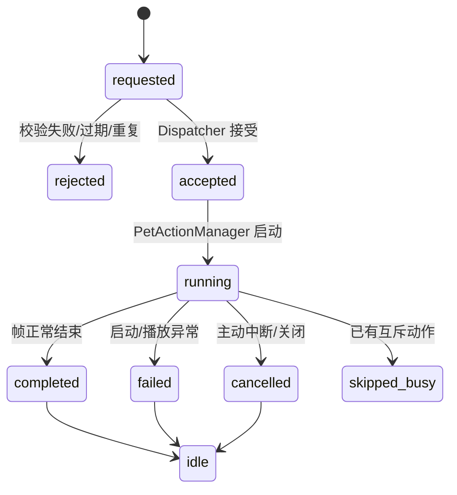

# 桌宠动作状态机（V1.8.2）

## 状态

PetActionManager 的稳定显示状态仍为 `idle`、`thinking`、`sleeping`、`dancing`、`reminding`。ClientActionResult 记录请求生命周期：

## 舞蹈策略

- `idle → dancing`：帧素材至少两张且 QTimer 成功启动。
- `dancing → idle`：完成三循环后 `_stop_dance_frames()` 清理帧、索引、pixmap 和 timer。
- 运行中再次请求：策略 B，返回 `skipped_busy`，不停止当前舞蹈、不排队、不虚假声称第二段已开始。
- 异常：`try/except` 捕获，立即 `restore_idle()`。
- 取消：`cancel_current_action()` 清理播放器并恢复 idle。
- failsafe：舞蹈启动后设置 30 秒单次释放计时器；正常完成时停止该计时器。

## 素材兼容

以下内容未修改：

- 路径：`assets/pet/dance/dance_*.png`
- 排序：按 `dance_<数字>` 数字升序
- 单帧时长：`DANCE_FRAME_DURATIONS_MS = (120, 110, 100, 110, 90, 140, 90, 140)`
- 循环次数：3
- 绘制逻辑与素材文件内容

## 诊断

请求日志包含 action_id、name、校验/派发结果、reason_code 和状态前后摘要。完成日志由帧播放器与 Manager 输出；不记录完整用户文本或私密数据。
