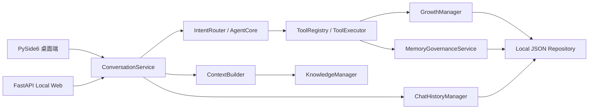

# RoxyPlan V1.5 封板说明

V1.5 是当前桌面端与 Local Web 共用核心能力的本地原型封板版本。它完成了统一会话、局域网移动控制台、知识上下文、成长工具、会话恢复和人工记忆治理，不代表公网产品已经完成。

## 当前架构



`server/` 只负责 HTTP、鉴权、字段白名单和静态页面，不复制计划、记忆、会话或知识业务逻辑，也不导入 PySide6。

## 封板功能

- 桌面聊天和 Web 聊天共用 `ConversationService`。
- 普通聊天使用人格、相关长期记忆、会话摘要、近期消息和限长知识片段。
- Local Web 提供聊天、今日计划、行动记录、成长日志、长期记忆和 Web 会话页面。
- 计划、行动、复盘和记忆页面按钮调用确定性工具，不依赖模型猜测。
- 长期记忆遵循“候选 → 人工审核 → 冲突处理 → 正式记忆 → 审计”流程。
- Ollama 离线时状态页降级为离线，计划、记忆和成长等本地工具仍可使用。
- 会话、成长和记忆 JSON 使用原子替换，损坏文件保留时间戳备份。

## 本地数据

| 数据 | 默认位置 | Git 策略 |
| --- | --- | --- |
| 长期记忆 | `memory.json` | 忽略，不提交 |
| 计划、行动、成长日志 | `data/private/` | 整个目录忽略 |
| 会话与摘要 | `data/private/chat_*.json` | 忽略 |
| 记忆候选、冲突、审计 | `data/private/memory_*.json` | 忽略 |
| 损坏与迁移备份 | `data/private/backups/` | 忽略 |
| 文件事务锁 | `data/private/locks/` | 忽略 |
| 本地知识文件 | `data/knowledge/` | 仅提交目录说明 |

测试必须使用临时目录和 Fake LLM，不应写入以上真实私人文件。

## 写入与并发边界

- JSON 写入使用同目录唯一临时文件、`flush`、`fsync` 和 `os.replace`。
- 同一文件的读改写使用私有锁目录中的轻量文件锁，可协调桌面与 Web 两个本机进程。
- Manager 在写操作前重新加载最新快照，避免常见的旧内存状态覆盖。
- 当前不是事务数据库：跨多个 JSON 文件的组合操作不能提供数据库级原子事务；强制终止进程时，极少数跨文件操作可能只完成一部分。
- 文件锁只面向同一台电脑上的 RoxyPlan 进程，不支持网络共享目录或多机写入。

## 局域网安全边界

- 未设置 `ROXY_LOCAL_TOKEN` 时，私有 API 只接受本机回环请求。
- 手机访问必须设置 Token，并通过 `X-Roxy-Token` 请求头发送。
- Token 只保存在浏览器当前标签页的 `sessionStorage`，不进入页面源码和服务日志。
- 页面使用 `textContent` 渲染用户内容，不使用 `innerHTML`。
- API 不接受任意本地文件路径；知识库目录由服务端固定配置。
- 删除、归档和冲突处理继续要求确认；确认记录只保存在运行时，服务重启后失效。
- 记忆审计 API 不返回完整变更正文，只返回操作元数据、分类、状态和正文长度。
- Local Web 仍定位为可信局域网工具，不提供公网暴露、TLS、账号或权限分级。

## 启动

桌面端：

```powershell
.\roxy.bat
```

Local Web：

```powershell
.\run_roxy_web.bat
```

本机访问 `http://127.0.0.1:8000`。手机访问步骤见 [local_web_v0_1.md](local_web_v0_1.md)。启动脚本使用自身目录定位项目，不包含私人绝对路径。

## 已知限制

- Ollama 和模型仍需用户自行启动和配置，错误文案属于本地降级提示。
- JSON 方案适合单机原型，不适合高并发、多用户或跨设备同步。
- Web 没有账号、权限角色、TLS 和公网部署能力。
- 知识库仅支持轻量 `.txt` / `.md` 关键词检索。
- 记忆候选采用保守规则，不会让模型直接写正式长期记忆。
- 桌面和 Web 可同时运行，但不建议把私人数据目录放在网络同步盘上并由多台电脑同时写入。

## 明日手动验收

1. 启动桌面端，确认聊天、设置、成长面板、记忆管理和桌宠动作可用。
2. 启动 Local Web，检查 `/health` 和状态页；保持 Ollama 关闭时确认页面仍可打开。
3. Ollama 离线时添加、完成一个计划，并新增一条行动记录。
4. 启动 Ollama 后进行普通聊天，确认同一 Web 会话刷新后可以恢复。
5. 放入一个 `.md` 知识文件，验证相关问题命中、无关问题不注入全文。
6. 测试稳定偏好候选、敏感信息默认跳过和“请记住”后的人工审核。
7. 制造一组早晚学习偏好冲突，测试保留旧、使用新或暂不处理。
8. 检查审计页面只显示元数据，不显示完整记忆正文。
9. 桌面与 Web 同时各添加一条不同计划，确认两条都保留。
10. 重启 Web 后尝试使用旧确认 ID，确认操作已失效且原数据未被删除。

## 回滚

- 停止 Local Web 不影响 PySide6 桌面端。
- 关闭 `enable_memory_candidates` 可停止生成新候选，已有候选仍可审核。
- 回滚代码前保留 `memory.json` 和 `data/private/`；不要用旧代码覆盖这些私人文件。
- 如发现 JSON 损坏，优先查看 `data/private/backups/`，不要直接删除原文件。
- 本次未迁移到数据库，也未改变现有公开 API 主路径；回滚不需要数据库降级脚本。
