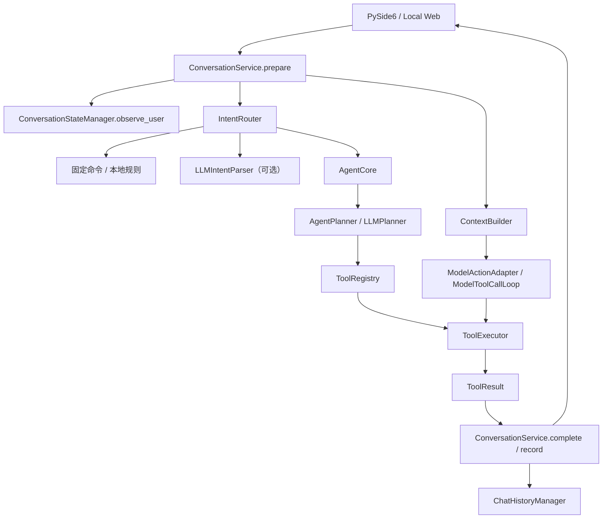
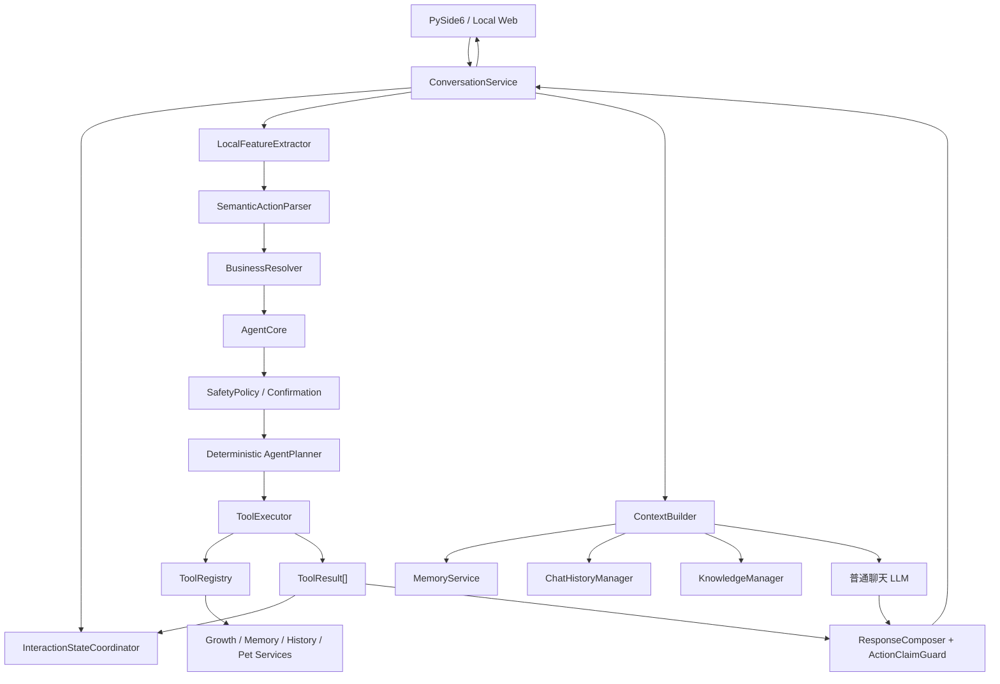

# RoxyPlan 开源对话 Agent 架构专项研究

> 调研日期：2026-07-23
> 范围：只研究源码、测试、官方文档与 RoxyPlan 现有实现，不实施架构迁移。
> 结论基线：RoxyPlan 当前运行环境为 Python 3.8.8、Pydantic 1.10.15。

## 证据标记

- **[源码确认]**：结论来自指定仓库的实现或测试文件。
- **[文档确认]**：结论来自官方 README、官方文档或发布说明。
- **[结构推断]**：根据源码结构与 RoxyPlan 现状作出的工程判断，不代表上游项目承诺。

本报告记录的是调研时点的仓库快照。`main` 分支会继续变化，正式引入依赖前应重新锁定版本和提交。

## 1. 执行摘要

RoxyPlan 当前最主要的问题不是“正则写得不够多”，也不是“模型还不够大”，而是**同一轮用户输入可能经过多套语义决策机制，同时交互状态、对象解析、工具执行和最终回复没有形成唯一闭环**。

目前项目已经具备正确方向上的大部分组件：`ConversationService`、`IntentRouter`、`AgentCore`、`AgentPlanner`、`ModelActionAdapter`、`ToolRegistry`、`ToolExecutor`、`SafetyPolicy`、`ConfirmationManager`、`ActionClaimGuard`、各类 Manager 和可序列化契约。问题在于这些组件之间仍存在职责重叠：

1. `LLMIntentParser`、`LLMPlanner`、`ModelActionAdapter` 都可能解释用户语义。
2. `ConfirmationManager`、`ConversationStateManager`、记忆候选和冲突流程分别维护部分待处理状态。
3. 指代、序号、业务对象和时间解析分散在路由器、`ReferenceResolver` 与工具处理函数中。
4. “你了解我什么”一旦未被路由成确定性的记忆查询，就会落入普通聊天，模型只能根据当前上下文猜测，因而可能错误回答“没有相关记忆”。
5. 最终自然语言回复与真实 `ToolResult` 的关系仍需进一步收紧，尤其是多工具、部分失败和异步回复场景。

### 推荐结论

**推荐保留 RoxyPlan 自研架构，不直接引入完整 Agent 框架。** 原因不是这些框架不好，而是当前主流版本普遍要求 Python 3.10+ 与 Pydantic 2，而 RoxyPlan 是 Python 3.8.8 与 Pydantic 1.10.15；直接引入会把一次对话链修复升级成运行时、依赖和数据迁移工程。

应重点借鉴以下模式：

1. **OpenAI Agents SDK**：可序列化 `RunState`、按 `tool_call_id` 绑定审批、工具执行计划、恢复时去重、部分失败隔离。
2. **Pydantic AI**：工具 schema、参数验证、工具绑定重试、最大重试次数、延迟工具和人工审批。
3. **LangGraph**：显式状态图、`interrupt` / `Command(resume=...)`、检查点和恢复语义。
4. **memory-agent / LangMem**：稳定 `user_id` 与会话 `thread_id` 分离；记忆工具和记忆提取流程分离。
5. **Semantic Kernel**：工具白名单、自动函数调用过滤器、参数错误作为函数结果回送、调用次数上限。
6. **MCP**：标准化工具发现与调用协议，但不把 MCP 误当成意图路由、确认状态机或记忆系统。

### 推荐目标

在现有架构上增加或统一六个职责：

- `InteractionStateCoordinator`：统一澄清、确认、候选审核、等待工具结果、部分成功、取消和过期状态。
- `SemanticActionParser`：成为唯一的模型语义解释入口，产出候选动作，不执行工具。
- `LocalFeatureExtractor`：提取否定、疑问、时间、时长、序号、指代表达和危险操作线索。
- `BusinessResolver`：使用当前业务数据确定对象 ID、时间值和候选项，不让模型决定真实对象。
- `MemoryService`：统一长期记忆查询、候选、冲突、归档与上下文检索的业务入口。
- 保留 `ChatHistoryManager`，仅补服务门面；当前没有必要再复制一个独立的历史存储系统。

核心原则是：

> 模型可以提出“想做什么”，程序必须决定“能否做、对哪个对象做、是否需要确认、是否真的做成”。最终回复只能依据真实 `ToolResult`。

## 2. RoxyPlan 当前问题根因

### 2.1 当前真实调用链

根据当前源码，可归纳出以下主链路：



关键源码位置：

- `modules/conversation_service.py`：`ConversationService.prepare()`、`complete()`、`build_llm_messages()`、`_record_response()`。
- `modules/intent_router.py`：`LLMIntentParser`、`IntentRouter.route()`、固定命令和本地语义规则。
- `modules/agent_planner.py`：`LLMPlanner`、`AgentPlanner`。
- `modules/model_action_adapter.py`：`ModelActionAdapter`、`ModelToolCallLoop.complete()`。
- `modules/agent_core.py`：`process()`、`handle_confirmation()`、`execute_model_tool_calls()`。
- `modules/tool_registry.py`：工具定义、schema 导出和业务处理器注册。
- `modules/tool_executor.py`：参数验证、执行、确认后执行和结果包装。
- `modules/confirmation_manager.py`：按 scope 保存运行时待确认请求。
- `modules/conversation_state.py`：按 `conversation_id` 保存运行时事实、抑制类别和指代上下文。
- `modules/reference_resolver.py`：从会话上下文和业务数据解析对象引用。
- `modules/contracts.py`：`IntentResult`、`ProposedAction`、`ToolResult`、`PendingConfirmation`、`AgentResponse` 等。

### 2.2 根因分解

| 现象 | 直接原因 | 更深层原因 |
|---|---|---|
| 换一种说法就落入普通聊天 | 固定规则未命中，模型动作层也未稳定产出工具调用 | 没有唯一的语义动作协议和统一降级顺序 |
| 模型说“已添加”，数据未改变 | 普通回复与工具执行结果可分离 | 最终回复没有被强制绑定到 `ToolResult.success` |
| “确认这个”找不到对象 | 待处理状态、对象候选和最近引用分散 | 缺少统一的会话交互状态对象 |
| 新会话查询长期记忆错误 | `show_memory` 未命中时交给 LLM；会话 ID 与用户记忆作用域混淆 | 长期记忆查询没有稳定的确定性入口和 `user_id` 边界 |
| 多工具调用回复不稳定 | 调用顺序、依赖、失败策略不明确 | 缺少显式 `ActionBatch` / `ToolExecutionPlan` |
| 澄清、危险确认和候选审核混在一起 | 都表现为“等待用户输入”，但业务语义不同 | 缺少统一外壳下的不同 `interaction_kind` |
| 状态重启后丢失 | `ConfirmationManager` 与 `ConversationStateManager` 主要是进程内字典 | 没有可序列化、可过期、可恢复的交互状态存储 |
| 规则不断增加 | 规则同时承担语义理解、实体解析和安全判断 | 规则与模型、业务解析器的职责边界未固定 |

### 2.3 三个重复决策点

**[源码确认]** 当前至少存在三处可能调用模型进行语义决策：

1. `LLMIntentParser`：把文本分类为意图。
2. `LLMPlanner`：把意图或消息转换为动作计划。
3. `ModelActionAdapter` / `ModelToolCallLoop`：从原生 tool call 或 JSON fallback 生成动作。

三者并非一定每轮同时运行，但它们都可能成为“用户到底想做什么”的权威来源。长期看会产生以下问题：同一句话在不同入口结果不同、一次模型失败后进入另一套逻辑、工具 schema 与意图枚举逐渐不一致。

### 2.4 长期记忆查询错误的核心

“你都了解我什么”“我以前告诉过你哪些事”不是普通生成式问答，而是**确定性数据查询**。正确流程应为：

```text
自然表达
→ SemanticActionParser: show_memory
→ MemoryService.list/search(user_id)
→ 程序格式化真实结果
→ AgentResponse
```

不能依赖“恰好把记忆注入了上下文，再让 LLM 回忆”。上下文注入用于辅助普通聊天，不能替代数据查询。新会话只应清空会话级工作状态，不应改变稳定 `user_id` 对应的长期记忆作用域。

## 3. 调研项目清单

以下快照在 2026-07-23 获取。版本列优先写稳定发布；无发布时写项目自身版本。

| 项目 | 调研快照 | 稳定版本 | Python / 主要依赖 | 许可证 | 对 RoxyPlan 的判断 |
|---|---|---|---|---|---|
| `langchain-ai/langgraph` | `main@31f90df3e6b0` | 1.2.9 | Python >=3.10，Pydantic >=2.7.4，LangChain Core | MIT | 借鉴状态图、interrupt、checkpoint；暂不直接引入 |
| `langchain-ai/memory-agent` | `main@070248455380` | 0.0.1 | Python >=3.10，LangGraph 1.x、LangChain 1.x | MIT | 借鉴 `user_id` 与 thread 分离及记忆工具回环 |
| `langchain-ai/langmem` | `main@a2d580946465` | 0.0.30 | Python >=3.10，LangGraph、LangChain、Trustcall | MIT | 借鉴热路径工具与后台提取分离；不直接采用自动写记忆 |
| `pydantic/pydantic-ai` | `main@61d751ec55f6` | 2.16.0 | Python >=3.10，Pydantic 2 | MIT | 最值得借鉴工具 schema、验证、重试和延迟审批 |
| `openai/openai-agents-python` | `main@0530398ef296` | 0.18.3 | Python >=3.10，Pydantic >=2.12.2，OpenAI SDK 2.x | MIT | 最值得借鉴可序列化运行状态和工具执行计划 |
| `microsoft/semantic-kernel` | `main@acb3e35c540d` | Python 1.44.0 | Python >=3.10，Pydantic 2 | MIT | 借鉴函数过滤器、白名单和错误回送 |
| `microsoft/autogen` | `main@027ecf0a379b` | Python 0.7.5 | Python >=3.10，Pydantic >=2.10 | 代码 MIT；仓库文档 CC BY 4.0 | 借鉴消息模型、工具循环上限；项目已进入维护模式 |
| `letta-ai/letta` | `main@b76da9092518` | 0.16.8 | Python >=3.11，Pydantic 2、FastAPI、SQLAlchemy | Apache-2.0 | 借鉴记忆层次和用户/会话边界；不适合替换本地 JSON |
| `modelcontextprotocol/python-sdk` | `main@3a6f2996cdd8` | v1.28.1 | Python >=3.10，Pydantic 2 | MIT | 将来可做工具互操作；当前不解决 Agent 路由和状态 |

### 兼容性结论

**[源码确认]** 上述 Python 主实现的当前版本均不兼容 RoxyPlan 的 Python 3.8.8 / Pydantic 1.10.15 组合。
**[结构推断]** 为引入任一完整框架而整体升级运行时，短期风险高于其收益。当前应复制设计模式和契约思想，而不是复制源码或增加依赖。

## 4. 每个项目的具体源码位置

### 4.1 LangGraph

关键源码：

- [`libs/langgraph/langgraph/types.py`](https://github.com/langchain-ai/langgraph/blob/main/libs/langgraph/langgraph/types.py)
  - `interrupt(value)`：首次调用抛出 `GraphInterrupt`；恢复时通过 `Command(resume=...)` 提供值。
  - 节点恢复后会从节点开头重新执行，因此 interrupt 之前的副作用必须幂等。
- [`libs/prebuilt/langgraph/prebuilt/tool_node.py`](https://github.com/langchain-ai/langgraph/blob/main/libs/prebuilt/langgraph/prebuilt/tool_node.py)
  - `ToolNode`：读取 `AIMessage.tool_calls`，解析工具、注入 state/store/runtime、执行并返回 `ToolMessage`。
  - 未知工具和参数验证错误被转换为与 `tool_call_id` 绑定的错误消息。
  - 支持并行执行和 `Command` 状态更新。
- [`libs/prebuilt/langgraph/prebuilt/chat_agent_executor.py`](https://github.com/langchain-ai/langgraph/blob/main/libs/prebuilt/langgraph/prebuilt/chat_agent_executor.py)
  - 预构建 ReAct 图：模型节点与工具节点循环，直到没有工具调用。
- [`libs/checkpoint/langgraph/checkpoint/base/__init__.py`](https://github.com/langchain-ai/langgraph/blob/main/libs/checkpoint/langgraph/checkpoint/base/__init__.py)
  - Checkpoint 抽象，保存 channel values、versions、pending sends 等运行状态。

**[源码确认] 完整流程：**

```text
用户消息进入 Graph State
→ agent/model 节点调用模型
→ 模型返回 AIMessage.tool_calls
→ 条件边选择 ToolNode
→ ToolNode 校验工具名和参数、执行工具
→ 生成绑定 tool_call_id 的 ToolMessage
→ ToolMessage 通过 reducer 写回状态
→ 回到 agent/model 节点
→ 模型依据真实工具结果生成最终文本
```

LangGraph 自身不负责“语言理解是否正确”，它负责让状态与执行路径显式、可检查点和可恢复。

### 4.2 memory-agent

关键源码：

- [`src/memory_agent/graph.py`](https://github.com/langchain-ai/memory-agent/blob/main/src/memory_agent/graph.py)
  - `call_model()`：按 `("memories", user_id)` 检索记忆，并将最近消息作为查询。
  - `route_message()`：有工具调用则进入 `store_memory`，否则结束。
  - `store_memory()`：执行记忆工具，并返回绑定原 `tool_call_id` 的 tool 消息。
- [`src/memory_agent/tools.py`](https://github.com/langchain-ai/memory-agent/blob/main/src/memory_agent/tools.py)
  - `upsert_memory()`：模型可见参数与运行时注入的 `user_id` / store 分离。
  - 支持用 `memory_id` 更新冲突或更正的记忆。
- [`src/memory_agent/state.py`](https://github.com/langchain-ai/memory-agent/blob/main/src/memory_agent/state.py)
  - `State.messages` 使用 reducer 累积消息。

**[源码确认]** 最值得借鉴的是长期记忆以稳定 `user_id` 为 namespace，而会话由 thread/checkpoint 管理。新建会话不应丢失长期记忆。

### 4.3 LangMem

关键源码：

- [`src/langmem/knowledge/tools.py`](https://github.com/langchain-ai/langmem/blob/main/src/langmem/knowledge/tools.py)
  - `create_manage_memory_tool()`：生成 create/update/delete 记忆工具，可用 `actions_permitted` 限制动作。
  - create 不允许传 ID；update/delete 必须传 ID。
  - `create_search_memory_tool()`：生成检索工具，支持 query、limit、offset 和 filter。
- [`src/langmem/knowledge/extraction.py`](https://github.com/langchain-ai/langmem/blob/main/src/langmem/knowledge/extraction.py)
  - `MemoryManager`：让模型基于 schema 对已有记忆执行 insert/update/delete。
  - 使用 `max_steps` 限制记忆整理循环。
  - `create_thread_extractor()`：从线程提取结构化摘要或记忆。

**[结构推断]** RoxyPlan 可借鉴“对话热路径只提出候选、后台或显式流程再整理”的边界，但不能直接采用 LangMem 默认的自动更新/删除正式记忆方式。

### 4.4 Pydantic AI

关键源码（v2.16.0）：

- [`pydantic_ai_slim/pydantic_ai/_function_schema.py`](https://github.com/pydantic/pydantic-ai/blob/v2.16.0/pydantic_ai_slim/pydantic_ai/_function_schema.py)
  - `FunctionSchema`、`function_schema()`：从 Python 签名和注解生成 JSON Schema 与 `SchemaValidator`。
- [`pydantic_ai_slim/pydantic_ai/tools.py`](https://github.com/pydantic/pydantic-ai/blob/v2.16.0/pydantic_ai_slim/pydantic_ai/tools.py)
  - `Tool`、`ToolDefinition`、`prepare_tool_def()`：定义模型可见工具和每轮动态可见性。
- [`pydantic_ai_slim/pydantic_ai/tool_manager.py`](https://github.com/pydantic/pydantic-ai/blob/v2.16.0/pydantic_ai_slim/pydantic_ai/tool_manager.py)
  - `ToolManager.validate_tool_call()`：先解析并验证参数，不执行。
  - `execute_tool_call()`：只执行已验证调用。
  - `_resolve_tool()`：未知工具转为 `ModelRetry`。
  - `_wrap_error_as_retry()`：生成绑定 `tool_call_id` 的 `RetryPromptPart`。
  - `_check_max_retries()`：每工具重试预算。
- [`pydantic_ai_slim/pydantic_ai/_agent_graph.py`](https://github.com/pydantic/pydantic-ai/blob/v2.16.0/pydantic_ai_slim/pydantic_ai/_agent_graph.py)
  - `ModelRequestNode`、`CallToolsNode`：模型请求、工具调用和再次请求的显式图节点。
  - 处理 dangling/orphan tool calls，确保调用与结果配对。
- [`pydantic_ai_slim/pydantic_ai/toolsets/approval_required.py`](https://github.com/pydantic/pydantic-ai/blob/v2.16.0/pydantic_ai_slim/pydantic_ai/toolsets/approval_required.py)
  - `ApprovalRequiredToolset`：需要审批时抛出 `ApprovalRequired`，审批后重新验证参数并执行。
- 测试：[`tests/test_tools.py`](https://github.com/pydantic/pydantic-ai/blob/v2.16.0/tests/test_tools.py)、[`tests/test_deferred_tool.py`](https://github.com/pydantic/pydantic-ai/blob/v2.16.0/tests/test_deferred_tool.py)。

**[源码确认] 完整流程：**

```text
Python 工具签名
→ FunctionSchema / ToolDefinition
→ 模型请求携带工具 schema
→ 模型返回 ToolCallPart(name, args, tool_call_id)
→ ToolManager.resolve
→ ToolManager.validate_tool_call
→ 失败：RetryPromptPart(tool_call_id) + 有界重试
→ 成功：execute_tool_call
→ ToolReturnPart(tool_call_id)
→ ModelRequestNode 再次调用模型
→ 最终自然语言输出
```

审批调用不会伪装成普通失败，而是形成 `DeferredToolRequests` / `DeferredToolResults`，恢复时仍以调用 ID 关联。

### 4.5 OpenAI Agents Python

关键源码（v0.18.3）：

- [`src/agents/items.py`](https://github.com/openai/openai-agents-python/blob/main/src/agents/items.py)
  - `ToolCallItem`、`ToolCallOutputItem`：工具调用与结果是独立可回放项。
- [`src/agents/run_internal/turn_resolution.py`](https://github.com/openai/openai-agents-python/blob/main/src/agents/run_internal/turn_resolution.py)
  - `process_model_response()`：把 provider 输出分类为工具、handoff、审批等运行项。
  - `execute_tools_and_side_effects()`：协调工具、审批、guardrail 和下一状态。
  - `resolve_interrupted_turn()`：从待审批状态恢复，按 call ID 重建调用并跳过已有输出。
  - 不存在的工具产生 `ToolRunFunctionNotFound` 或 `ModelBehaviorError`，不会直接执行任意名称。
- [`src/agents/run_internal/tool_planning.py`](https://github.com/openai/openai-agents-python/blob/main/src/agents/run_internal/tool_planning.py)
  - `ToolExecutionPlan`：把可执行、拒绝、待确认和 MCP 审批分开。
  - `_build_tool_output_index()`、`_dedupe_tool_call_items()`：按调用身份去重并避免恢复时重复执行。
  - `_collect_runs_by_approval()`：区分已批准、已拒绝和待处理。
  - `_execute_tool_plan()`：支持顺序/并行以及并行失败隔离。
- [`src/agents/run_state.py`](https://github.com/openai/openai-agents-python/blob/main/src/agents/run_state.py)
  - `RunState`：可序列化运行状态，当前 schema 版本由 `CURRENT_SCHEMA_VERSION` 管理。
  - `approve()`、`reject()`、`to_json()`、`from_json()`：审批和恢复。
- 测试：[`tests/test_run_internal_approvals.py`](https://github.com/openai/openai-agents-python/blob/main/tests/test_run_internal_approvals.py)、[`tests/test_run_context_approvals.py`](https://github.com/openai/openai-agents-python/blob/main/tests/test_run_context_approvals.py)、[`tests/test_agent_tool_state.py`](https://github.com/openai/openai-agents-python/blob/main/tests/test_agent_tool_state.py)。

**[源码确认] 完整流程：**

```text
用户输入 + RunState
→ Runner 请求模型
→ provider 输出工具调用
→ process_model_response 解析并核对已注册工具
→ ToolExecutionPlan 划分执行 / 审批 / 拒绝 / 特殊调用
→ 参数验证、guardrail 与审批检查
→ 实际执行并生成 ToolCallOutputItem
→ 输出项加入下一轮模型输入
→ NextStepRunAgain 再次请求模型
→ 模型基于真实输出生成最终回复
```

若有待确认项，则返回 `NextStepInterruption`。恢复时使用序列化 `RunState`、`call_id` 和已有 output index，避免重复执行。

### 4.6 Semantic Kernel

关键源码（Python 1.44.0）：

- [`python/semantic_kernel/kernel.py`](https://github.com/microsoft/semantic-kernel/blob/main/python/semantic_kernel/kernel.py)
  - `Kernel.invoke_function_call()`：校验允许的函数、缺失/多余参数、JSON 格式，执行并把 `FunctionResultContent` 写回历史。
  - 未知工具不会执行，而是写回“工具不在提供列表”的结果供模型修正。
- [`python/semantic_kernel/connectors/ai/function_choice_behavior.py`](https://github.com/microsoft/semantic-kernel/blob/main/python/semantic_kernel/connectors/ai/function_choice_behavior.py)
  - `FunctionChoiceBehavior.Auto()`、`Required()`、`NoneInvoke()`。
  - 默认 `maximum_auto_invoke_attempts` 为 5，可通过 filters 约束可见函数。
- [`python/semantic_kernel/contents/function_call_content.py`](https://github.com/microsoft/semantic-kernel/blob/main/python/semantic_kernel/contents/function_call_content.py)
  - `FunctionCallContent` 保存 name、arguments、id、call_id、index，并解析参数。
- [`python/semantic_kernel/contents/function_result_content.py`](https://github.com/microsoft/semantic-kernel/blob/main/python/semantic_kernel/contents/function_result_content.py)
  - `FunctionResultContent` 把结果与调用 ID 关联。
- [`python/semantic_kernel/filters/auto_function_invocation/auto_function_invocation_context.py`](https://github.com/microsoft/semantic-kernel/blob/main/python/semantic_kernel/filters/auto_function_invocation/auto_function_invocation_context.py)
  - `AutoFunctionInvocationContext` 带 request/function sequence index 和 `terminate`。
- 示例：[`python/samples/concepts/filtering/auto_function_invoke_filters.py`](https://github.com/microsoft/semantic-kernel/blob/main/python/samples/concepts/filtering/auto_function_invoke_filters.py)。
- 测试：`python/tests/integration/completions/test_chat_completion_with_function_calling.py`、`python/tests/unit/connectors/ai/test_function_choice_behavior.py`。

**[源码确认]** SK 的过滤器可以在工具执行前后做审批、参数修正、审计或终止调用序列，这与 RoxyPlan 的 `SafetyPolicy` / `ConfirmationManager` 方向一致。

### 4.7 AutoGen

关键源码（Python 0.7.5）：

- [`python/packages/autogen-core/src/autogen_core/tools/_function_tool.py`](https://github.com/microsoft/autogen/blob/main/python/packages/autogen-core/src/autogen_core/tools/_function_tool.py)
  - `FunctionTool` 从类型注解生成 schema，并承担参数验证与序列化。
- [`python/packages/autogen-core/src/autogen_core/tool_agent/_tool_agent.py`](https://github.com/microsoft/autogen/blob/main/python/packages/autogen-core/src/autogen_core/tool_agent/_tool_agent.py)
  - 工具执行 Agent，处理未知工具和无效参数。
- [`python/packages/autogen-core/src/autogen_core/tool_agent/_caller_loop.py`](https://github.com/microsoft/autogen/blob/main/python/packages/autogen-core/src/autogen_core/tool_agent/_caller_loop.py)
  - `tool_agent_caller_loop()`：模型返回调用后并发发送给工具 Agent，把 `FunctionExecutionResultMessage` 加入消息，再请求模型。
- [`python/packages/autogen-agentchat/src/autogen_agentchat/agents/_assistant_agent.py`](https://github.com/microsoft/autogen/blob/main/python/packages/autogen-agentchat/src/autogen_agentchat/agents/_assistant_agent.py)
  - `AssistantAgent`：`max_tool_iterations` 控制内部工具循环；多个工具默认并发。
  - `save_state()` / `load_state()` 保存模型上下文。
- [`python/packages/autogen-core/src/autogen_core/memory/_base_memory.py`](https://github.com/microsoft/autogen/blob/main/python/packages/autogen-core/src/autogen_core/memory/_base_memory.py)
  - `Memory` 抽象：`query()`、`add()`、`update_context()`、`clear()`。
- 测试：`python/packages/autogen-core/tests/test_tool_agent.py`、`python/packages/autogen-core/tests/test_tools.py`、`python/packages/autogen-agentchat/tests/test_assistant_agent.py`。

**[文档确认]** AutoGen 当前处于维护模式，新项目被建议转向 Microsoft Agent Framework。
**[结构推断]** RoxyPlan 是单 Agent、本地业务工具和桌面 UI，不值得为了消息总线和多 Agent runtime 引入 AutoGen。

### 4.8 Letta

关键源码（0.16.8）：

- [`letta/schemas/memory.py`](https://github.com/letta-ai/letta/blob/main/letta/schemas/memory.py)
  - `Memory`：区分 core memory blocks、file blocks、summary、archival/recall 元数据。
  - `BasicBlockMemory`、`ChatMemory`：用 `persona` 和 `human` 等块形成在上下文中的稳定记忆。
  - `core_memory_append()` / `core_memory_replace()`：显式修改记忆块。
- [`letta/helpers/tool_rule_solver.py`](https://github.com/letta-ai/letta/blob/main/letta/helpers/tool_rule_solver.py)
  - `ToolRulesSolver`：支持 init、child、parent、terminal、continue、max-count、required-before-exit 和 requires-approval 规则。
  - `get_allowed_tool_names()`：按历史工具调用动态缩小下一步可调用工具集合。
- [`letta/services/tool_executor/tool_execution_manager.py`](https://github.com/letta-ai/letta/blob/main/letta/services/tool_executor/tool_execution_manager.py)
  - `ToolExecutionManager.execute_tool_async()`：统一选择 executor 并返回 `ToolExecutionResult`。
- [`letta/schemas/tool_execution_result.py`](https://github.com/letta-ai/letta/blob/main/letta/schemas/tool_execution_result.py)
  - 标准化工具执行结果。
- [`letta/services/memory_repo/`](https://github.com/letta-ai/letta/tree/main/letta/services/memory_repo)
  - git-backed memory repository 与本地投影。

**[源码确认]** Letta 将 core memory、summary memory、recall history 和 archival memory 明确区分。
**[结构推断]** 其完整服务依赖 FastAPI、SQLAlchemy、数据库与 Python 3.11，不适合 RoxyPlan 当前本地 JSON 架构；可借鉴“用户画像块与会话历史不是一类数据”。

### 4.9 MCP Python SDK

关键源码（稳定 v1.x；主分支正演进到 v2）：

- [`src/mcp_types/types.py`](https://github.com/modelcontextprotocol/python-sdk/blob/main/src/mcp-types/mcp_types/types.py)
  - `ToolUseContent` / `ToolResultContent`：用唯一 ID 关联调用与结果。
  - `Task`：`working`、`input_required`、`completed`、`failed`、`cancelled` 等状态。
- [`src/mcp/server/mcpserver/tools/base.py`](https://github.com/modelcontextprotocol/python-sdk/blob/main/src/mcp/server/mcpserver/tools/base.py)
  - 从函数构造工具 schema，执行参数适配。
- [`src/mcp/server/mcpserver/tools/tool_manager.py`](https://github.com/modelcontextprotocol/python-sdk/blob/main/src/mcp/server/mcpserver/tools/tool_manager.py)
  - `ToolManager.add_tool()`、`list_tools()`、`call_tool()`；未知工具抛出 `ToolError`。
- [`src/mcp/client/session.py`](https://github.com/modelcontextprotocol/python-sdk/blob/main/src/mcp/client/session.py)
  - 客户端列出、调用工具和处理协议会话。
- 测试：`tests/server/mcpserver/test_tool_manager.py`、`tests/interaction/mcpserver/test_tools.py`、`tests/client/test_session.py`。

**[源码确认]** MCP 定义的是跨进程/跨服务的能力协议。
**[结构推断]** 它不能决定“把下午学习机器学习加入计划”究竟是建议、计划写入还是普通聊天，也不提供 RoxyPlan 需要的业务确认和长期记忆治理。

## 5. 工具调用方案对比

### 5.1 对比表

| 项目 | LLM 是否直接选工具 | 中间结构 | 参数失败 | 循环上限 | 人工确认 | 防止虚假成功 |
|---|---|---|---|---|---|---|
| LangGraph | 通常是 | `AIMessage.tool_calls` + graph state | ToolNode 生成错误 ToolMessage | 由图递归/运行配置控制 | `interrupt` + resume | 最终模型看到 ToolMessage；应用仍需结果约束 |
| Pydantic AI | 是 | `ToolCallPart` / `ValidatedToolCall` | 绑定 call ID 的 RetryPrompt | 全局和每工具重试预算 | Deferred requests/results | 结果必须形成 ToolReturnPart |
| OpenAI Agents | 是 | `ToolRun*` + `ToolExecutionPlan` | 错误/行为异常形成输出项 | `max_turns` 等边界 | RunState interruption | 最终回复前有真实 ToolCallOutputItem |
| Semantic Kernel | 是 | `FunctionCallContent` | 错误写回 FunctionResultContent | 默认自动调用最多 5 次 | invocation filter | 历史中存在真实函数结果 |
| AutoGen | 是 | `FunctionCall` / `FunctionExecutionResult` | 工具 Agent 返回错误或抛异常 | `max_tool_iterations` | 可通过 intervention/handoff 自建 | 结果消息回到模型，但应用仍需校验最终声明 |
| MCP | 不负责模型选择 | `ToolUseContent` / `CallToolResult` | JSON-RPC / ToolError | 协议不规定 Agent 循环 | elicitation / task 能提供基础协议 | 只保证调用协议，不保证最终回复真实性 |

### 5.2 成熟方案的共同闭环

```text
注册工具 schema
→ 模型提出 tool call
→ 解析工具名
→ 参数 schema 校验
→ 业务校验 / 安全策略 / 人工确认
→ 实际执行
→ 生成带 tool_call_id 的结果
→ 结果加入消息或运行状态
→ 模型根据真实结果生成最终回复
→ 应用再次检查成功声明
```

共同点不是“让 LLM 更自由”，而是**让 LLM 的权限停在提出调用，程序掌握验证、执行和事实**。

### 5.3 本地规则、语义模型和原生 tool calling 的正确边界

#### 本地规则保留

规则应保留在以下稳定、低歧义、需要确定性的场景：

- 精确固定命令和 UI 按钮动作。
- “确认 / 取消 / 第 2 个 / 这个”在已有 pending state 下的控制词。
- 明确 ID、序号、日期格式和时长格式。
- 否定、撤销、删除、清空、覆盖等安全关键词。
- 输入规范化、空文本、长度限制和危险工具拦截。
- provider 不可用时的最低可用查询命令。

不应继续用规则承担：

- 为每种自然说法枚举完整句子。
- 判断“想学习”是愿望、建议请求还是写计划。
- 从复杂句中决定多个动作及其语义依赖。
- 凭关键词直接决定真实业务对象。

#### DeepSeek / 其他模型负责

- 区分普通聊天、信息陈述、建议请求和执行请求。
- 产生一个或多个 `ActionCandidate`。
- 提取用户原文中的标题、时间短语、时长短语和引用短语。
- 给出 `confidence`、`ambiguities` 和 `needs_clarification`。
- 在工具返回真实结果后润色回复，但不得改变结果事实。

#### 程序必须负责

- 工具白名单、schema 和参数类型验证。
- 相对时间解析后的最终值。
- “刚才那个”“前一个计划”对应的真实对象 ID。
- 候选冲突、唯一性和是否允许自动执行。
- 安全策略、确认、过期、幂等、执行顺序。
- 数据写入和后置条件检查。
- 最终成功/失败/部分成功的事实。

### 5.4 原生 tool calling 与结构化 Intent 是否重复

如果二者都让模型独立判断完整意图，确实重复。推荐改为：

- `SemanticActionParser` 统一暴露一个 provider-neutral 输出协议。
- provider 支持稳定原生 tools 时，内部使用原生 tool calling。
- provider 不支持或结果不合格时，内部使用受限 JSON structured output。
- 两种方式都转成同一个 `ActionCandidate`，后续只走一次 `BusinessResolver` 和 `AgentCore`。
- `IntentResult` 可作为兼容字段或低成本初筛结果，不再单独触发第二套模型规划。

### 5.5 如何避免“规则失败 → 普通聊天 → 模型虚构成功”

应增加动作声明门：

1. `LocalFeatureExtractor` 判断文本是否具有明显操作性，如“加入、记录、删除、改成、执行、保存、标记”等组合特征。
2. 明显操作性输入不得直接 fallback 到普通聊天。
3. 原生工具调用失败时只允许一次结构化动作解析修复。
4. 仍不明确时返回澄清，不生成“我已经做了”。
5. 最终回复生成器只能从 `ToolResult` 列表建立成功声明。
6. `ActionClaimGuard` 继续作为最终防线，而不是主要路由器。

## 6. 状态管理方案对比

### 6.1 上游项目提供的状态能力

| 项目 | 状态载体 | interrupt / resume | 持久化 | 关键限制 |
|---|---|---|---|---|
| LangGraph | Graph state + checkpoint | 原生 `interrupt` / `Command(resume)` | checkpointer | 恢复会重跑节点，副作用必须幂等 |
| Pydantic AI | graph state + deferred tool requests/results | 延迟调用和审批恢复 | 消息历史/外部 durable adapter | 依赖 Pydantic 2 与框架图运行时 |
| OpenAI Agents | `RunState` + `NextStep*` | `NextStepInterruption`，approve/reject 后恢复 | `to_json/from_json`，schema version | 当前 SDK 与 Roxy 运行时不兼容 |
| Semantic Kernel | chat history + invocation context | 过滤器可 terminate，需应用保存状态 | 由应用负责 | 不是完整业务交互状态机 |
| AutoGen | model context / agent state | handoff、termination、runtime message | `save_state/load_state` | 主要面向 Agent/团队状态，不是业务确认模型 |
| Letta | agent state + conversation + memory blocks | 服务端持久会话 | 数据库/服务 | 过重且数据架构不同 |
| MCP | JSON-RPC session + task/elicitation | 可表达 input_required/cancelled | 由实现负责 | 只是协议层 |

### 6.2 RoxyPlan 建议状态枚举

```text
idle
awaiting_clarification
awaiting_confirmation
awaiting_candidate_selection
awaiting_tool_result
partial_success
cancelled
expired
```

状态必须和桌宠视觉状态区分。这里是**对话交互状态**，不是 `idle/thinking/sleeping/dancing` 动画状态。

### 6.3 InteractionStateCoordinator 的职责

统一管理一个会话当前的待处理交互，但允许不同类型拥有独立 payload：

```json
{
  "schema_version": "1.0",
  "interaction_id": "int_...",
  "conversation_id": "conv_...",
  "user_id": "local_user",
  "state": "awaiting_confirmation",
  "interaction_kind": "dangerous_tool",
  "originating_turn_id": "turn_...",
  "action_candidates": [],
  "resolved_object_ids": [],
  "tool_call_ids": [],
  "candidate_ids": [],
  "created_at": "ISO-8601",
  "expires_at": "ISO-8601",
  "version": 1
}
```

处理原则：

- “确认”只作用于当前 conversation 中唯一且未过期的 pending interaction。
- 同时存在两个可确认对象时，必须要求选择，不能猜。
- “取消”只取消当前交互，不删除业务数据。
- 新会话清空 working reference 和 pending interaction；长期记忆仍按 `user_id` 可用。
- 服务重启后，危险写操作不自动继续。可恢复为“需要重新确认”，或明确标记 expired。
- 工具执行前写入 `awaiting_tool_result`，执行结束后记录 call ID 和结果，再进入 idle/partial_success。

### 6.4 候选审核与危险操作确认应分离

两者可以共用 coordinator 外壳，但必须使用不同 `interaction_kind`：

- `dangerous_tool`：确认是否执行删除、覆盖、清空等动作。
- `memory_candidate_review`：决定是否把候选升级为正式长期记忆。
- `ambiguity_selection`：从多个计划/记忆候选中选择对象。
- `missing_slot`：补充时间、标题等缺失参数。

这样“确认这个”才能根据状态选择正确的 resolver，而不是交给通用字符串判断。

### 6.5 多工具与部分失败

建议增加执行批次概念：

```json
{
  "batch_id": "batch_...",
  "policy": "stop_on_failure",
  "parallel": false,
  "calls": [
    {"tool_call_id": "call_1", "depends_on": []},
    {"tool_call_id": "call_2", "depends_on": ["call_1"]}
  ]
}
```

默认规则：

- 写操作顺序执行。
- 纯读取且互不依赖时才允许并行。
- `stop_on_failure`：后续依赖动作跳过。
- `best_effort`：互不依赖动作继续，最终状态为 `partial_success`。
- 每个结果保持独立 `tool_call_id`、`success`、`error_code` 和 `changed_resource_ids`。
- 最终回复按真实结果逐项总结，不得用一个成功掩盖其他失败。

## 7. 记忆方案对比

### 7.1 记忆类型

| 类型 | 用途 | 生命周期 | 是否进入普通上下文 |
|---|---|---|---|
| Working memory | 当前轮指代、待补参数、当前对象 | 短期，会话级 | 只供 resolver 使用 |
| Conversation history | 最近对话消息 | 会话级，可持久化 | 裁剪后进入 |
| Conversation summary | 压缩后的本次会话主题和决定 | 会话级 | 相关时进入 |
| Episodic memory | 过去发生的事件 | 用户级，通常有时间 | 检索相关时进入 |
| Profile / semantic memory | 稳定偏好、目标、规则 | 用户级长期 | 相关时进入 |
| Pending candidate | 待用户审核的信息 | 用户级治理数据 | **不得进入普通上下文** |
| Archived memory | 不再默认使用的历史记忆 | 长期 | 默认不进入 |
| Conflict | 新旧信息冲突记录 | 待治理 | 未解决前不默认进入 |

### 7.2 各项目的记忆特点

- **memory-agent**：`user_id` namespace 与 thread 分离，最直接解决“新会话后长期记忆消失”的边界问题。
- **LangMem**：支持搜索、创建、更新、删除和结构化提取，但默认自治程度高于 RoxyPlan 的人工治理策略。
- **AutoGen**：定义通用 `Memory.query/add/update_context` 接口；示例 `ListMemory` 会把全部内容注入，不适合作为相关性检索实现。
- **Letta**：最清楚地区分 core memory、recall、summary 与 archival memory，但完整实现依赖服务和数据库。
- **LangGraph / OpenAI Agents / Pydantic AI**：重点是运行状态和消息历史，不提供与 RoxyPlan 相同的候选审核治理策略。
- **MCP**：可以未来暴露 `search_memory` 等工具，但不定义记忆生命周期。

### 7.3 明确“记住”与自动候选

推荐统一经过 MemoryService，但入口策略不同：

```text
用户明确“请记住”
→ SemanticActionParser: request_memory_candidate(explicit=true)
→ 敏感性检查
→ 创建候选
→ 用户审核
→ 接受后写入正式记忆

普通聊天中的稳定偏好
→ 候选提取器（可选）
→ 低频、去重、敏感内容默认跳过
→ 创建候选
→ 用户审核
→ 接受后写入正式记忆
```

自动提取和明确请求可以共用候选存储、去重、冲突和审核逻辑，但不能绕过审核直接写正式记忆。

### 7.4 新会话的正确边界

- `conversation_id`：历史、摘要、当前引用、pending interaction。
- `user_id`：长期记忆、候选、冲突、用户级规则。
- `memory_id`：稳定记忆实体。
- `candidate_id`：待审核候选。
- `tool_call_id`：一次工具执行请求。

“新建对话”只创建新 `conversation_id`。`show_memory` 始终查询当前 `user_id` 的正式 active memories，不能向 LLM询问“你是否记得”。

### 7.5 时间事件与稳定偏好

程序应在候选进入长期记忆前区分：

- “我今天下午学了 50 分钟”是 action/episodic event，通常进入行动记录。
- “我通常早上学习效率更高”是 stable preference/habit，可进入候选。
- “我今天有点难过”是临时状态，默认不生成长期候选。
- “请记住我有某项健康限制”是敏感明确请求，进入待确认候选而非直接保存。

## 8. 最值得借鉴的设计排名

排名按 RoxyPlan 当前问题的适配价值，不按项目知名度或功能数量。

1. **OpenAI Agents：ToolExecutionPlan + 可序列化 RunState**
   直接对应确认、恢复、调用去重、部分失败和 call ID 绑定。
2. **Pydantic AI：验证与执行分离 + 有界重试 + Deferred Tool**
   直接对应不稳定本地/在线模型的参数错误和审批。
3. **LangGraph：显式状态、interrupt/resume、checkpoint**
   适合作为状态设计参照，但当前无需引入图运行时。
4. **memory-agent：user namespace 与 thread 分离**
   是修复新会话长期记忆错误的关键边界。
5. **Semantic Kernel：函数过滤器与允许列表**
   可加强工具执行前后的策略链。
6. **LangMem：记忆热路径与提取/整理路径分离**
   适合候选记忆治理，不适合直接自治修改正式记忆。
7. **MCP：标准工具协议**
   适合未来跨进程扩展，当前不应进入核心语义路径。
8. **AutoGen：消息模型与有界工具循环**
   设计可参考，但单 Agent 项目不需要多 Agent runtime，且已维护模式。
9. **Letta：记忆层次模型**
   理念价值高，直接技术复用成本最高。

## 9. RoxyPlan 推荐目标架构

### 9.1 架构图



### 9.2 现有模块去留

| 现有模块 | 建议 | 原因 |
|---|---|---|
| `ConversationService` | 保留，作为唯一桌面/Web 门面 | 已实现客户端复用，是正确边界 |
| `IntentRouter` | 保留固定命令与低成本规则；模型部分并入 SemanticActionParser | 避免继续成为第二套模型语义权威 |
| `AgentCore` | 保留并收紧输入契约 | 继续协调安全、执行和结果 |
| `AgentPlanner` | 保留，但改为对已验证 ActionCandidate 做确定性计划 | 不再二次调用模型理解同一输入 |
| `LLMPlanner` | 逐步停用或并入 SemanticActionParser | 与 LLMIntentParser / ModelActionAdapter 重复 |
| `ModelActionAdapter` | 演化为 SemanticActionParser 的 provider adapter | 原生 tool call 与 JSON fallback 应统一在这里 |
| `ToolRegistry` | 保留 | 工具 schema 与 handler 单一来源 |
| `ToolExecutor` | 保留，增加批次策略与后置条件 | 已具备正确执行边界 |
| `SafetyPolicy` | 保留 | 危险动作必须程序判断 |
| `ConfirmationManager` | 合并到 InteractionStateCoordinator | 当前只覆盖一种 pending 状态且主要在内存中 |
| `ConversationStateManager` | 合并其 pending/reference 职责到 coordinator；上下文事实可保留 | 避免状态散落 |
| `ReferenceResolver` | 并入或由 BusinessResolver 统一调用 | 对象、时间和业务数据应一次解析 |
| `ActionClaimGuard` | 保留为最终防线 | 不能代替路由，但能阻止虚假成功声明 |
| `MemoryManager` 等 | 保留，通过 MemoryService 门面组合 | 不改数据格式，统一调用语义 |
| `ChatHistoryManager` | 保留 | 已有持久会话，不复制第二套历史服务 |

### 9.3 是否需要新增六个模块

#### InteractionStateCoordinator：需要

统一 pending interaction、引用对象、过期和恢复。它不存业务实体正文，只存 ID、状态和必要的安全元数据。

#### SemanticActionParser：需要

统一原生 tool calling 和 JSON fallback。它只提出候选动作，不执行、不写数据、不决定真实 ID。

#### LocalFeatureExtractor：需要，但可先作为内部组件

它应是轻量纯 Python 辅助器，不发展成大规模自然语言规则库。

#### BusinessResolver：需要

把“刚才那个”“前一个计划”“改成 50 分钟”映射到真实业务对象与规范参数。模型只给引用短语，程序完成最终解析。

#### MemoryService：需要门面，不需要新存储

组合现有 `MemoryManager`、`MemoryCandidateManager`、治理与检索能力，确保桌面、Web、Agent 都走同一确定性入口。

#### ConversationHistoryService：暂不单独新增

`ChatHistoryManager` 已覆盖会话、消息和摘要。可增加少量面向 ConversationService 的查询方法，避免创建同义层。

### 9.4 桌面、Web 和 Agent 的共用方式

所有自然语言输入：

```text
Desktop/Web → ConversationService.handle(message, conversation_id, user_id)
```

所有确定性页面按钮：

```text
Desktop/Web → ConversationService.execute_command(ActionCandidate, conversation_id, user_id)
```

二者最终都进入 `AgentCore → ToolExecutor → Manager/Service`。客户端不得直接拼接“已完成”回复，也不得在 server 目录复制业务处理器。

## 10. 模块接口契约

以下为设计草案，不是本轮实现。

### 10.1 LocalFeatureExtractor

输入：

```json
{
  "text": "把刚才那个改成50分钟",
  "locale": "zh-CN",
  "now": "ISO-8601"
}
```

输出：

```json
{
  "normalized_text": "把刚才那个改成50分钟",
  "is_question": false,
  "is_negated": false,
  "operation_cues": ["modify"],
  "danger_cues": [],
  "time_expressions": [],
  "duration_expressions": [{"text": "50分钟", "minutes": 50}],
  "reference_expressions": [{"text": "刚才那个", "kind": "recent_object"}],
  "ordinal_expressions": []
}
```

### 10.2 SemanticActionParser

输入：

```json
{
  "schema_version": "1.0",
  "request_id": "req_...",
  "conversation_id": "conv_...",
  "text": "下午帮我留50分钟学特征工程，放进今天要做的事里",
  "features": {},
  "pending_interaction": null,
  "available_tools": []
}
```

输出：

```json
{
  "source": "native_tool_call",
  "candidates": [
    {
      "action_id": "act_...",
      "tool_name": "add_plan",
      "arguments": {
        "title": "学习特征工程",
        "duration_minutes": 50,
        "time_expression": "下午"
      },
      "reference_text": null,
      "confidence": 0.93,
      "ambiguities": [],
      "needs_clarification": false
    }
  ]
}
```

约束：只允许已注册工具名；未知字段保留兼容但不传给执行器；模型解析最多修复一次。

### 10.3 BusinessResolver

输入：

```json
{
  "candidate": {},
  "conversation_id": "conv_...",
  "user_id": "local_user",
  "reference_context": {},
  "now": "ISO-8601"
}
```

输出：

```json
{
  "status": "resolved",
  "resolved_action": {
    "tool_name": "update_plan",
    "arguments": {"task_id": "task_uuid", "duration_minutes": 50}
  },
  "candidate_objects": [],
  "missing_fields": [],
  "needs_confirmation": false,
  "reason_code": "unique_recent_task"
}
```

状态可为 `resolved`、`ambiguous`、`missing`、`not_found`、`forbidden`。

### 10.4 InteractionStateCoordinator

核心方法：

```text
get(conversation_id) -> InteractionState | None
begin_clarification(...)-> InteractionState
begin_confirmation(...)-> InteractionState
begin_candidate_selection(...)-> InteractionState
mark_tool_running(tool_call_ids)-> InteractionState
apply_user_control(text, conversation_id)-> InteractionTransition
complete(tool_results)-> InteractionTransition
cancel(conversation_id, reason)-> InteractionTransition
expire(now)-> list[InteractionTransition]
```

`InteractionTransition`：

```json
{
  "from_state": "awaiting_confirmation",
  "to_state": "awaiting_tool_result",
  "accepted_input": true,
  "selected_ids": ["task_uuid"],
  "next_action": "execute",
  "message_key": "confirmation_accepted"
}
```

### 10.5 工具执行契约

继续复用现有 `ProposedAction`、`AssistantToolCall` 和 `ToolResult`，补充以下语义：

- `tool_call_id`：一轮中唯一，恢复和结果关联依据。
- `idempotency_key`：写操作去重依据。
- `depends_on`：多动作依赖。
- `status`：`success`、`failed`、`skipped`、`denied`、`expired`。
- `changed_resource_ids`：真实发生改变的实体 ID。
- `user_message`：去敏、可公开的确定性结果摘要。

### 10.6 MemoryService

```text
list_memories(user_id, filters) -> MemoryListResult
search_memories(user_id, query, limit) -> MemorySearchResult
create_candidate(user_id, content, source, sensitivity) -> CandidateResult
accept_candidate(user_id, candidate_id, edited_content?) -> ToolResult
reject_candidate(user_id, candidate_id) -> ToolResult
list_conflicts(user_id) -> ConflictListResult
resolve_conflict(user_id, conflict_id, resolution) -> ToolResult
retrieve_for_context(user_id, query, categories, limit) -> MemorySearchResult
```

要求：

- `show_memory` 调用 `list_memories`，不调用普通聊天模型回答事实。
- pending、rejected、archived 和 unresolved conflict 默认不进入普通上下文。
- 新会话仍使用相同 `user_id`。
- 日志只记录 ID、类别和数量，不记录敏感正文。

### 10.7 ChatHistoryManager 服务门面

建议补充但不新建重复存储：

```text
get_recent_context(conversation_id, limit) -> messages
get_summary(conversation_id) -> summary | None
get_reference_window(conversation_id) -> recent tool/object refs
start_session(user_id, title?) -> conversation_id
close_session(conversation_id) -> result
```

## 11. 分阶段实施计划

### 阶段 0：冻结行为基线

- 建立真实日常表达 golden corpus。
- 记录每轮 `request_id`、语义来源、候选动作、resolver 结果、tool call/result 和最终状态。
- 不改变执行逻辑，先测出当前误路由、误执行和虚假成功率。

### 阶段 1：统一交互状态

- 新增 `InteractionStateCoordinator`，先适配现有 `ConfirmationManager` 和 `ConversationStateManager`。
- 不立刻删除旧模块，通过 adapter 双写/对照测试。
- 让“确认、取消、这个、第几个”先读取 coordinator。

### 阶段 2：统一语义动作协议

- 定义唯一 `ActionCandidate` schema。
- 把原生 tool calling 与 JSON fallback 收进 `SemanticActionParser`。
- `LLMIntentParser` 只做兼容初筛，`LLMPlanner` 不再解释同一原始文本。
- 使用 feature flag 逐步切换，保留旧路径回滚。

### 阶段 3：建立 BusinessResolver

- 统一序号、ID、时间、时长、近期对象和“刚才那个”的解析。
- 模型只返回 reference text，不返回被信任的真实对象 ID。
- 未唯一匹配时生成候选选择状态。

### 阶段 4：修复记忆服务边界

- 增加 `MemoryService` 门面，不迁移数据格式。
- 所有 `show/search memory` 从桌面和 Web 确定性调用。
- 明确 `user_id` 与 `conversation_id` 分离。
- 候选、正式记忆、归档、冲突和上下文检索保持独立。

### 阶段 5：工具执行计划与部分失败

- 增加 `ActionBatch` / `ToolExecutionPlan`。
- 写操作默认顺序，读取可选并行。
- 实现 call ID 去重、幂等键、依赖跳过和 `partial_success`。
- 最终回复只从 ToolResult 生成事实骨架，再允许模型润色非事实部分。

### 阶段 6：持久化 pending interaction

- 使用现有 JSON Repository 风格保存最小交互状态。
- 原子写入、schema version、TTL 和损坏降级。
- 重启后危险操作必须重新确认，不自动继续副作用。

### 阶段 7：再评估运行时升级

只有在 Python 3.10+ / Pydantic 2 升级被单独批准并完成兼容测试后，才重新评估引入 Pydantic AI 或 OpenAI Agents 的局部层。当前阶段不应把框架升级与交互修复绑定。

## 12. 自动评测设计

### 12.1 测试集组成

每个能力至少准备以下变体：

- 明确执行：“把下午学习机器学习加入计划”。
- 模糊愿望：“下午想学点机器学习”。
- 建议请求：“下午可以学点什么？”
- 信息陈述：“我下午学了机器学习”。
- 否定：“我不想把这个加入计划”。
- 指代：“把刚才那个改成 50 分钟”。
- 多动作：“加到计划里，完成后也帮我记一条行动”。
- 取消：“算了，不执行了”。
- 新会话：“你都了解我什么”。
- 无历史：“你记得我们以前聊过什么吗”。

### 12.2 状态序列测试

不能只测单句，应测完整序列：

```text
用户：删除那个计划
系统：找到两个候选，请选择
用户：第二个
系统：删除需要确认
用户：确认这个
系统：执行一次，返回真实结果
用户：再确认
系统：不得重复执行
```

覆盖：

- `awaiting_clarification` 的补槽。
- `awaiting_confirmation` 的确认、拒绝、过期。
- `awaiting_candidate_selection` 的序号与指代。
- 新会话后 pending 清空、长期记忆保留。
- 服务重启后待确认动作重新确认或失效。

### 12.3 工具协议测试

- 模型返回不存在工具。
- 参数缺失、类型错误、多余字段。
- 业务对象不存在。
- 相同 `tool_call_id` 重放。
- 相同 idempotency key 重试。
- 两个工具全部成功。
- 第一个成功、第二个失败。
- 第一个失败导致依赖动作跳过。
- 模型无工具结果却声明“已完成”。
- 工具成功但最终模型错误描述结果。

### 12.4 记忆测试

- 新会话直接查询正式长期记忆。
- 普通聊天不展示 pending candidate。
- 候选确认和危险删除确认互不串线。
- 时间事件进入行动记录而非稳定偏好。
- 敏感信息只在明确请求和审核后保存。
- archived / unresolved conflict 不进入普通上下文。

### 12.5 Provider 矩阵

- Fake provider：确定性覆盖所有分支。
- DeepSeek：原生 tool calling、缺参、多个调用、模糊表达。
- Ollama/Qwen 降级：原生 tools 可用性与 JSON fallback。
- Provider 离线：确定性计划、记忆和历史查询仍工作。

### 12.6 建议指标

| 指标 | 目标 |
|---|---:|
| 明确操作工具选择准确率 | >= 95% |
| 否定句误执行率 | 0% |
| 危险操作未确认执行率 | 0% |
| 无 ToolResult 的虚假成功率 | 0% |
| 指代唯一时对象解析准确率 | >= 90% |
| 指代不明确时主动澄清率 | >= 95% |
| 新会话长期记忆查询准确率 | 100%（确定性接口） |
| 重放导致重复写入率 | 0% |
| 多工具结果事实一致率 | 100% |

## 13. 反模式与风险

### 13.1 反模式

1. **为每个失败例句增加一个 `if text == ...`。** 这只能修复样例，不能修复语义类别。
2. **让意图模型、Planner 和 tool calling 各自重新理解一次。** 多次模型判断会放大不一致。
3. **让模型返回数据库对象 ID 并直接信任。** ID 必须由本地 resolver 决定。
4. **把模型文本中的“已完成”当执行成功。** 事实只能来自 ToolResult。
5. **把长期记忆查询当上下文问答。** 查询必须调用 MemoryService。
6. **把 candidate confirmation 与 destructive confirmation 混为一种状态。** 两者的后续动作和安全等级不同。
7. **在 interrupt 前执行非幂等写入。** 恢复重跑可能重复副作用。
8. **默认并行所有工具。** 多个写操作可能违反顺序和业务约束。
9. **为框架能力整体升级 Python 与 Pydantic。** 会扩大当前修复范围。
10. **把 MCP 当 Agent。** MCP 只标准化能力接口，不提供业务理解和状态治理。

### 13.2 主要风险

- DeepSeek 与 Ollama 对工具 schema 的遵从度不同，必须保留 provider-neutral fallback。
- 语义解析结果即使结构合法，也可能业务含义错误，因此 BusinessResolver 必不可少。
- pending state 持久化后要避免重启自动执行旧副作用。
- 多客户端同时访问同一会话时需要版本号或 compare-and-swap，避免两个“确认”重复消费。
- 历史消息中旧对象序号会变化，内部必须使用稳定 ID，UI 序号仅用于展示。
- 记忆服务门面不能在迁移过程中复制或改写真实私人数据。
- 过度注入历史会使指代看似更聪明，却污染当前主题；引用窗口应小而结构化。

## 14. 下一版 Codex 实施任务建议

下一轮不应要求“一次重写完整 Agent”。建议提示词限定为第一阶段可回滚改造：

### 建议任务 A：交互状态统一

1. 新增 `InteractionStateCoordinator` 与可序列化 `InteractionState`。
2. 只接管现有确认、取消、候选选择和过期逻辑。
3. 通过 adapter 复用现有 `ConfirmationManager`，不立即删除旧接口。
4. 每个状态绑定 `conversation_id`、`turn_id`、`tool_call_id` 和业务对象稳定 ID。
5. 新增并发消费和重启失效测试。

### 建议任务 B：语义动作单一入口

1. 定义 `ActionCandidate` / `SemanticParseResult`。
2. 将原生 tool calling 和 JSON fallback 收入 `SemanticActionParser`。
3. `LLMIntentParser` 不再触发独立模型执行链。
4. `AgentPlanner` 只规划已经解析和业务验证的动作。
5. 明显操作性输入解析失败时澄清，不得进入普通聊天并声称成功。

### 建议任务 C：确定性记忆服务

1. 新增 `MemoryService` 门面，复用现有 Manager 和 Repository。
2. `show_memory/search_memory` 从所有客户端确定性调用。
3. 显式区分 `user_id` 和 `conversation_id`。
4. 新会话测试必须验证长期记忆仍可查询。
5. 不修改 `memory.json` 数据格式和内容。

### 建议任务 D：业务解析器

1. 集中处理时间、时长、序号、最近对象和候选匹配。
2. DeepSeek 只提取原始实体短语，程序解析最终值和对象 ID。
3. 先覆盖计划、行动记录和记忆三个域。
4. 不唯一时进入 `awaiting_candidate_selection`。

### 建议任务 E：执行真实性

1. 为多工具增加明确的顺序、依赖和失败策略。
2. ToolResult 补齐 status、changed IDs 和 idempotency key。
3. 最终回复从真实 ToolResult 构建事实骨架。
4. `ActionClaimGuard` 验证“已添加/已删除/已保存”等声明。
5. 保证无 ToolResult 时虚假成功率为 0。

### 实施时必须保留的限制

- 不直接引入上述大型框架。
- 不升级 Python/Pydantic，除非单独立项。
- 不修改真实私人数据。
- 不复制桌面和 Web 两套业务逻辑。
- 不让模型自动执行删除、清空、覆盖或正式记忆写入。
- 所有改动使用 feature flag 和现有测试基线，允许逐阶段回滚。

## 15. 来源和链接

### RoxyPlan 本地源码

- [`modules/conversation_service.py`](../../modules/conversation_service.py)
- [`modules/intent_router.py`](../../modules/intent_router.py)
- [`modules/model_action_adapter.py`](../../modules/model_action_adapter.py)
- [`modules/agent_planner.py`](../../modules/agent_planner.py)
- [`modules/agent_core.py`](../../modules/agent_core.py)
- [`modules/tool_registry.py`](../../modules/tool_registry.py)
- [`modules/tool_executor.py`](../../modules/tool_executor.py)
- [`modules/confirmation_manager.py`](../../modules/confirmation_manager.py)
- [`modules/conversation_state.py`](../../modules/conversation_state.py)
- [`modules/reference_resolver.py`](../../modules/reference_resolver.py)
- [`modules/contracts.py`](../../modules/contracts.py)
- [`modules/memory_manager.py`](../../modules/memory_manager.py)
- [`modules/memory_candidate_manager.py`](../../modules/memory_candidate_manager.py)
- [`modules/memory_governance.py`](../../modules/memory_governance.py)
- [`modules/chat_history_manager.py`](../../modules/chat_history_manager.py)

### 官方仓库

- [LangGraph](https://github.com/langchain-ai/langgraph) · [MIT License](https://github.com/langchain-ai/langgraph/blob/main/LICENSE)
- [memory-agent](https://github.com/langchain-ai/memory-agent) · [MIT License](https://github.com/langchain-ai/memory-agent/blob/main/LICENSE)
- [LangMem](https://github.com/langchain-ai/langmem) · [MIT License](https://github.com/langchain-ai/langmem/blob/main/LICENSE)
- [Pydantic AI](https://github.com/pydantic/pydantic-ai) · [MIT License](https://github.com/pydantic/pydantic-ai/blob/main/LICENSE)
- [OpenAI Agents Python](https://github.com/openai/openai-agents-python) · [MIT License](https://github.com/openai/openai-agents-python/blob/main/LICENSE)
- [Semantic Kernel](https://github.com/microsoft/semantic-kernel) · [MIT License](https://github.com/microsoft/semantic-kernel/blob/main/LICENSE)
- [AutoGen](https://github.com/microsoft/autogen) · [code license](https://github.com/microsoft/autogen/blob/main/LICENSE-CODE) · [documentation license](https://github.com/microsoft/autogen/blob/main/LICENSE)
- [Letta](https://github.com/letta-ai/letta) · [Apache-2.0 License](https://github.com/letta-ai/letta/blob/main/LICENSE)
- [MCP Python SDK](https://github.com/modelcontextprotocol/python-sdk) · [MIT License](https://github.com/modelcontextprotocol/python-sdk/blob/main/LICENSE)
- [MCP Specification](https://github.com/modelcontextprotocol/modelcontextprotocol)

### 官方说明和关键测试

- [LangGraph interrupts](https://docs.langchain.com/oss/python/langgraph/interrupts)
- [Pydantic AI tools](https://ai.pydantic.dev/tools/)
- [Pydantic AI deferred tools](https://ai.pydantic.dev/deferred-tools/)
- [OpenAI Agents human-in-the-loop](https://openai.github.io/openai-agents-python/human_in_the_loop/)
- [OpenAI Agents run state](https://openai.github.io/openai-agents-python/ref/run_state/)
- [Semantic Kernel auto function invocation sample](https://github.com/microsoft/semantic-kernel/blob/main/python/samples/concepts/filtering/auto_function_invoke_filters.py)
- [AutoGen tool-equipped agent guide](https://microsoft.github.io/autogen/stable/user-guide/core-user-guide/framework/tools.html)
- [MCP tools specification](https://modelcontextprotocol.io/specification/2025-06-18/server/tools)

## 结论

RoxyPlan 已经拥有实现可靠对话 Agent 所需的大部分底层零件，不需要推翻重做。下一阶段最有价值的工作不是增加更多正则，也不是立即更换框架，而是完成三项统一：

1. **统一语义动作提案**：原生 tool calling 与 JSON fallback 只产出同一种候选动作。
2. **统一交互状态**：澄清、确认、候选选择、工具等待和部分失败都有可序列化状态与稳定 ID。
3. **统一业务事实入口**：对象解析、长期记忆查询、工具执行和最终成功声明都由程序确定。

这样才能从根本上解决“换种说法不执行”“确认对象丢失”“新会话说没有记忆”“模型声称完成但工具没执行”等一组同源问题，同时继续保持本地优先、低依赖、可测试和桌面/Web 共用核心逻辑。
