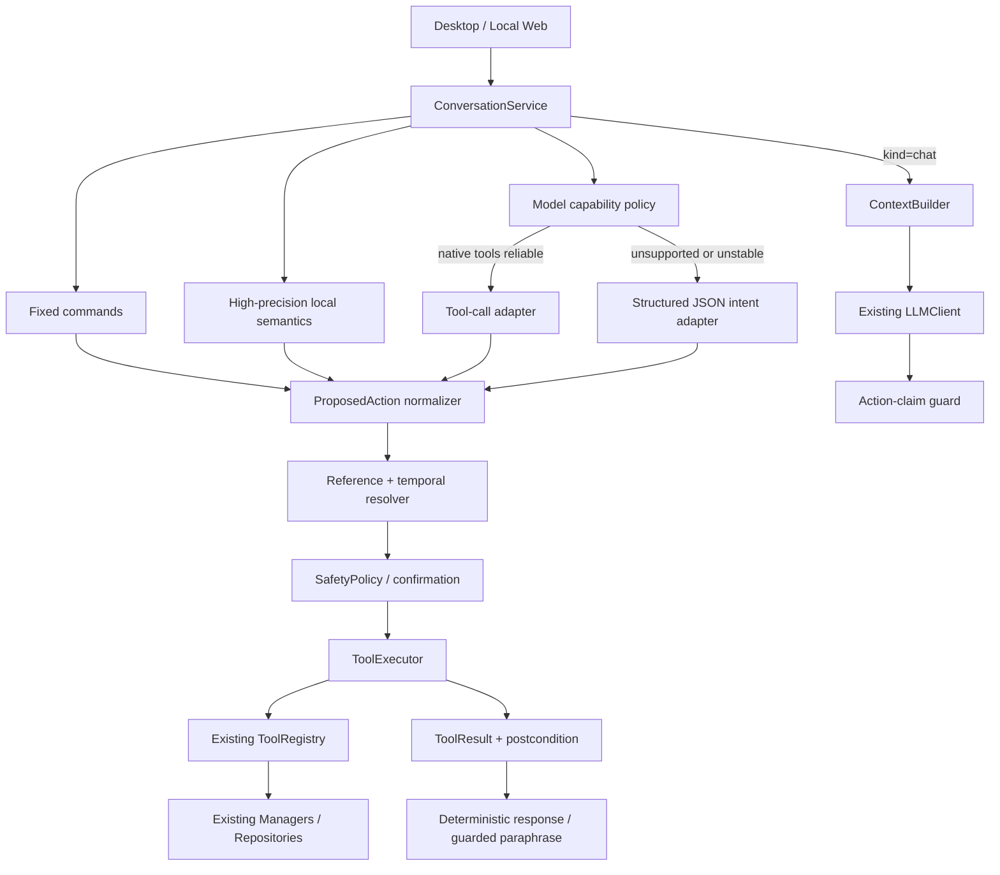
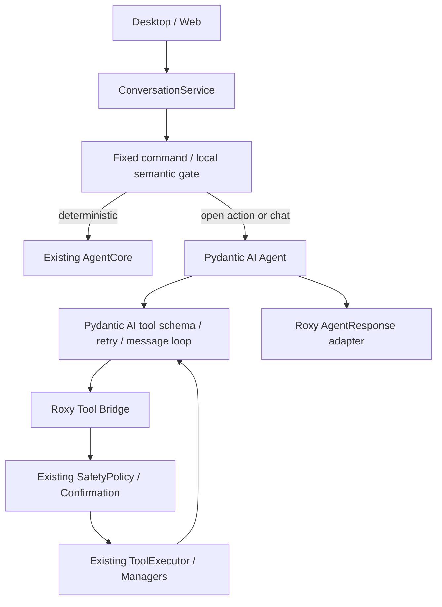
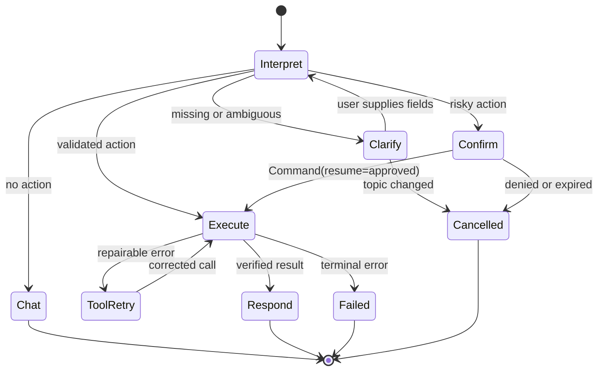

# RoxyPlan Agent 架构候选方案

研究日期：2026-07-22

## 1. 目标与基线

目标不是让模型拥有更多权限，而是让自然语言动作经过一条可证实的链路：

```text
理解用户表达
  -> 生成动作提议
  -> 本地参数/对象/风险校验
  -> 必要时澄清或确认
  -> 执行白名单工具
  -> 验证真实结果
  -> 只按事实回复
```

必须保留：

- `ConversationService` 作为桌面/Web 共用入口。
- Growth/Memory/ChatHistory Manager 业务规则。
- Repository 与现有 Local JSON 格式。
- `ToolRegistry/ToolExecutor/SafetyPolicy` 权限边界。
- PySide6 QThread，不在主线程等待模型。
- 模型离线时固定命令和本地工具仍可使用。

## 2. 推荐的统一内部契约

无论采用哪套方案，模型原生 tool call、JSON IntentResult 和本地规则都应先归一化：

```json
{
  "proposal_id": "prop_xxx",
  "source": "fixed | rule | model_tool | model_json",
  "kind": "chat | action | clarification",
  "intent": "add_plan",
  "tool_name": "add_plan",
  "arguments": {"title": "学习机器学习", "duration_minutes": 30},
  "confidence": 0.9,
  "evidence": ["加入计划", "30分钟"],
  "missing_fields": [],
  "needs_confirmation": false,
  "risk_level": "medium",
  "reference": null
}
```

模型输出不能直接构造 `ToolResult`。`ToolResult` 只能由 `ToolExecutor` 和真实 handler 产生。

建议状态：

```text
chat
interpreting
clarification_pending
confirmation_pending
executing
tool_retry
responding
completed
failed
cancelled
```

## 3. 方案 A：保留自研架构，借鉴成熟工具协议

### 架构图



### 数据流

1. 固定命令优先。
2. 高精度规则只处理确定边界和基础实体。
3. 未命中但带动作可能性的文本进入模型动作提议器。
4. 按模型能力选择原生 tool calling 或 JSON Intent，不重复跑两套模型判断。
5. 全部结果规范化为 `ProposedAction`。
6. 本地解析指代、时间、目标和缺失字段。
7. Policy 决定直接执行、澄清、确认或拒绝。
8. Executor 调现有 Registry/Manager，并验证后置条件。
9. 写操作由真实 ToolResult 生成确定性回复；普通 chat 经过动作声明门。

### 预计修改的模块

候选新增：

- `modules/action_proposal.py`
- `modules/model_action_adapter.py`
- `modules/reference_resolver.py`
- `modules/temporal_parser.py`
- `modules/action_claim_guard.py`
- `tests/fixtures/agent_utterances.json`

候选轻量修改：

- `intent_router.py`：返回统一 proposal，不继续膨胀规则。
- `conversation_service.py`：选择 action adapter 或 chat。
- `agent_core.py`：消费规范化 proposal。
- `tool_registry.py`：只读导出 provider-neutral schema。
- `contracts.py`：增加可序列化 proposal/tool-call message。
- `chat_history_manager.py`：保存必要的工具轨迹摘要，不暴露内部敏感参数。
- `settings_dialog.py`：模型动作模式和评测通过后开关。

### 保留模块

Manager、Repository、ToolExecutor、SafetyPolicy、ConfirmationManager、ContextBuilder、MemoryRetriever、桌宠动作和 UI 主体全部保留。

### 优点

- 最小迁移面，符合当前 Python 3.8 和 Pydantic 1。
- 可同时兼容无 tool-call 模型、Ollama 原生 tools 和未来 provider。
- 确定性事实链不依赖模型。
- 可逐步上线和逐项回滚。
- 现有 28 个测试脚本和 Local JSON 不需迁移。

### 风险

- 继续承担自研协议维护成本。
- schema/export/retry 需要自己实现一小部分成熟框架已有能力。
- 没有现成 durable graph；跨重启工作流仍有限。
- 若不先建立语料评测，规则仍可能继续失控膨胀。

### 工作量

中等，建议拆成 4 个小阶段，每阶段独立可回滚。核心协议约 5-9 个工程日；本地模型评测和语料整理另计。

### 对模型要求

- 最低：能稳定输出一个浅层 JSON 对象。
- 可选增强：能返回 OpenAI/Ollama 风格 tool calls。
- 不要求模型自行维护状态或决定安全策略。

### 测试策略

- 固定语料分类和实体 golden tests。
- Fake model 分别模拟原生 tool calls、非法 JSON、未知工具、缺参数和普通文本。
- 所有写操作用临时 Repository。
- 断言无成功 ToolResult 时不能出现完成式动作回复。
- 桌面和 Web 对同一输入应返回等价 AgentResponse。
- qwen3:4b 只做可选本地评测，不成为单元测试依赖。

### 回滚难度

低。保留旧规则/JSON parser 开关，新增 adapter 可整体禁用。

## 4. 方案 B：Pydantic AI 作为模型与工具协议层

### 架构图



### 数据流

Pydantic AI 负责 provider 请求、工具 schema、tool-call message、参数 Pydantic 校验和模型重试；Roxy bridge 仍调用现有 Executor，审批仍由 Roxy 管理，最终转为现有 AgentResponse。

### 预计修改的模块

- 升级 Python 到 >=3.10。
- 升级 Pydantic 1 -> 2、FastAPI 和相关测试。
- 新增 Pydantic AI model/tool bridge。
- 适配 QThread 中 async/sync 运行和取消。
- 将现有 ToolDefinition 导出为 Pydantic tool，避免重复 handler。
- 调整消息历史以保存/恢复 ToolCallPart 与 ToolReturnPart。
- 决定审批使用 Pydantic deferred flow 还是现有 ConfirmationManager；不能长期保留两套真相源。

### 保留模块

Manager、Repository、业务 handler、SafetyPolicy、UI、ContextBuilder、Memory/Growth 逻辑应保留。

### 优点

- 标准工具闭环、Pydantic 参数验证和有界重试现成。
- provider-neutral，官方包含 Ollama/OpenAI-compatible 支持。
- deferred tool approval 和 usage limits 成熟。
- 后续 structured output 和评测工具更容易扩展。

### 风险

- 运行时升级是独立大工程，会影响桌面打包和 Local Web。
- Pydantic AI 更新快，当前已是 2.x；需要锁版本和适配策略。
- qwen3:4b 可能无法稳定遵循复杂 schema，框架会更清楚地暴露失败，但不会提高模型智力。
- 如果 bridge 设计不好，会出现 Pydantic tools 与 Roxy Registry 双重 schema/确认。
- 审批恢复需要保存完整 tool-call message history。

### 工作量

中高。Python/Pydantic/FastAPI 升级与 Agent bridge 合计约 12-20 个工程日，并需要 Windows 桌面回归。

### 对模型要求

原生 tool calls 或 structured output 至少一种要在目标模型上稳定。小模型必须设置低复杂度 schema、低重试预算和明确失败降级。

### 测试策略

- 先用 FakeModel 跑 Pydantic AI 官方模式。
- 再用临时工具 bridge 验证 ToolResult 和确认。
- 最后对 qwen3:4b 做离线语料通过率测试。
- Python/Pydantic 升级必须跑桌面启动、FastAPI、QThread、打包和全部 Repository 测试。

### 回滚难度

中高。建议先建隔离分支/运行时 PoC，旧 ConversationService 路径保留到迁移验收后。

## 5. 方案 C：LangGraph 重构执行状态机

### 架构图



### 数据流

Graph state 保存消息、proposal、tool calls、ToolResult、pending interrupt 和 remaining steps。模型节点与工具节点形成回环；澄清和确认用 interrupt 暂停，checkpointer 保存状态。

### 预计修改的模块

- Python/Pydantic 升级。
- AgentCore/Planner/ConfirmationManager 的控制流迁移为 graph nodes。
- 选择并实现 checkpointer 持久化；Local JSON 是否足够需单独评估。
- ConversationService 变为 graph adapter。
- 桌面 QThread 和 Web 需要统一 stream/resume 接口。
- ToolRegistry 转 LangChain BaseTool 或 ToolNode wrapper。
- AgentResponse 从 graph state 派生。

### 保留模块

Manager、Repository、业务 handler、ContextBuilder 和 UI 可保留，但 AgentCore/Planner/Confirmation 的主控制权会明显变化。

### 优点

- 澄清、确认、失败、重试和恢复成为显式状态。
- 复杂多步骤、跨轮和未来多 Agent 工作流可扩展。
- checkpointer 和执行轨迹适合可靠恢复与调试。

### 风险

- 对当前三步以内的本地助手属于过度设计。
- 引入 LangChain Core 类型和图运行时，学习与维护成本最高。
- checkpointer 会推动新的持久化设计，容易触碰“不引入数据库”的边界。
- interrupt 恢复会重跑节点，副作用必须幂等。
- 小模型并不会因图框架提高意图准确率。

### 工作量

高，约 20-35 个工程日，且需要逐功能迁移和双轨验证。

### 对模型要求

与方案 B 类似；复杂图不能补偿工具选择不稳定。模型只应决定有限节点中的动作提议，状态和审批由图控制。

### 测试策略

- 图节点、边和状态快照单元测试。
- checkpointer 恢复和 interrupt 幂等测试。
- 多会话隔离、服务重启、并发和取消测试。
- 旧 ConversationService 与 graph 双轨 golden comparison。

### 回滚难度

高。需要长期保留旧执行路径，直到全部固定命令、桌面、Web 和恢复流程验收。

## 6. 三套方案比较

| 维度 | 方案 A 自研演进 | 方案 B Pydantic AI | 方案 C LangGraph |
| --- | --- | --- | --- |
| Python 3.8 兼容 | 是 | 否 | 否 |
| 保留现有架构 | 最好 | 较好 | 一般 |
| 原生工具协议 | 需补轻量 adapter | 成熟 | 依赖模型/LangChain 工具 |
| 参数验证/重试 | 需增强 | 成熟 | 成熟但需组装 |
| 可恢复 HITL | 当前有限 | 成熟 deferred flow | 最强 |
| 本地 JSON 保持 | 容易 | 容易 | checkpointer 需设计 |
| 对 qwen3:4b | 可按能力降级 | 框架支持但模型仍可能失败 | 同样依赖模型 |
| 工作量 | 中 | 中高 | 高 |
| 回滚 | 容易 | 中高 | 困难 |
| 当前适配度 | **最高** | 运行时升级后候选 | 当前过重 |

## 7. 明确推荐

**推荐方案 A：保留现有自研架构，只借鉴成熟项目的协议、状态和测试模式。**

原因：

1. RoxyPlan 已有真正的业务边界和执行安全层，缺的是模型协议适配，不是整个 Agent 框架。
2. Python 3.8/Pydantic 1 让直接引入现代框架成为运行时迁移工程。
3. qwen3:4b 的瓶颈是语义和工具格式稳定性；先建立模型能力评测比换框架更重要。
4. 方案 A 可以把原生 tool calls 和 JSON fallback 都规范化后送入现有 Executor，不绑定模型。
5. 写操作继续由真实 ToolResult 决定回复，能直接解决“模型说添加了但实际未执行”。
6. 当未来 Python 升级完成且工具协议测试稳定时，方案 B 可以替换 adapter，不浪费本轮设计。

2026-07-22 的本机实测为这个选择增加了直接证据：`qwen3:4b` 能输出原生 tool call，但完成计划和行动记录会稳定混淆，多工具只有 1/3 成功；当前 JSON fallback 同样不能稳定通过业务字段校验。此时替换框架不会消除模型语义错误，方案 A 的本地事实门、澄清和评测层更优先。

不推荐现在采用方案 C。只有在“确认需跨重启恢复、跨天流程、多个长链任务或多 Agent 协作”成为真实需求时，LangGraph 的收益才明显。

## 8. 分阶段实施顺序

### 阶段 0：评测先行

- 建立 150-300 条中文语料，覆盖动作/咨询/愿望/否定/指代/危险操作。
- 记录预期 intent、entities、是否澄清、是否确认、是否执行。
- 建 Fake Model 和 qwen3:4b 可选评测，不修改真实数据。

### 阶段 1：统一动作提议契约

- 固定命令、规则、LLM JSON 统一为 `ProposedAction`。
- 将“缺字段”和“多个目标”变为一等状态。
- 增加动作声明门。

### 阶段 2：schema 和指代解析

- ToolRegistry 导出 provider-neutral JSON Schema。
- 独立 ReferenceResolver 和 TemporalParser。
- 写操作后置条件覆盖全部工具。

### 阶段 3：可选原生 tool-call adapter

- 不改 Manager/Executor。
- 只在评测达标的模型上开启。
- 原生失败自动降级 JSON proposal，再失败则澄清。

### 阶段 4：状态与恢复

- 显式 turn state 和有限 retry budget。
- 继续使用重启失效的确认，或单独批准持久化 pending proposal。
- 若复杂流程增长，再重新评估 Pydantic AI/LangGraph。

## 9. 风险清单

1. 规则、JSON parser 和原生 tool calling 三套输出若不归一化，会形成三套行为。
2. 模型 confidence 不可信，不能直接映射执行权限。
3. tool schema 描述太长会压缩 4B 模型有效上下文。
4. 给小模型一次展示太多工具会降低选对率；应按当前领域动态缩小工具集合。
5. 模型重试可能重复写操作；执行前必须使用 request/tool_call ID 幂等检查。
6. 并行写入当前 JSON 会增加覆盖风险；默认顺序。
7. 指代使用完整聊天文本会引入隐私和污染；只提供结构化近期引用。
8. 工具错误直接回模型可能泄露路径/异常；只传安全错误码和必要字段。
9. 模型最终回复仍可能虚构；写操作必须确定性汇报，普通 chat 需动作声明门。
10. Python 升级与 Agent 重构不能在同一轮同时发生，否则回归来源不可判断。

## 10. 需要用户决定的问题

正式实施前只需要决定：

1. 是否继续维持 Python 3.8 一个版本，先做方案 A；本报告建议是。
2. 是否允许下一轮新增“模型动作提议/评测”模块，但不改 `llm_client.py` 核心。
3. 写操作中哪些可以高置信度直接执行：建议新增计划/行动记录可直接，修改/完成低置信度需确认，删除/覆盖始终确认。
4. pending confirmation 是否继续在重启后失效；建议先保持现状。
5. qwen3:4b 原生 tool calling 的最低启用阈值，例如工具选择 >=90%、危险误执行 =0、参数完整 >=85%。

## 11. 下一轮正式升级提示词应包含的任务

建议下一轮命名为“RoxyPlan V1.7：模型动作提议协议与 Agent 评测底座”，范围严格限制为方案 A 的阶段 0-1：

```text
目标：
在不更换 Python、不引入 Agent 大框架、不改变 Manager/Repository/私人数据格式的前提下，
把固定命令、本地规则和可选模型 JSON 解析统一为一个可序列化 ProposedAction，
并建立中文动作语料评测，阻止普通聊天虚构工具已执行。

任务：
1. 新增 ProposedAction/ActionEvidence/ActionResolution 轻量契约，兼容 Python 3.8。
2. 固定命令和现有规则先适配该契约，保持现有功能行为。
3. 新增 provider-neutral ModelActionParser 接口；当前只包装现有 LLM JSON，不修改 llm_client.py 核心。
4. 同一消息只允许选择“原生工具提议”或“JSON 意图提议”一种模型路径，禁止重复判断。
5. 新增 ReferenceResolver，先处理 last_tool_result、last_task、明确编号和多候选澄清。
6. ToolRegistry 提供只读 schema 导出，不复制 handler，不把 Manager 暴露给模型。
7. 新增 ActionClaimGuard：没有成功 ToolResult 时，普通聊天不得输出已添加、已保存、已删除、已完成等系统事实。
8. 建立 tests/fixtures/agent_utterances.json，覆盖动作、咨询、愿望、否定、指代、时间和危险操作。
9. 新增离线 Fake Model 评测：分类准确率、参数完整率、澄清率、危险误执行率、虚假完成率。
10. 所有写测试使用临时 Repository；不得改真实 memory.json、data/private 或 config.json。

必须保持：
- ConversationService 为桌面/Web 统一入口。
- ToolExecutor/SafetyPolicy/ConfirmationManager 是唯一执行与审批边界。
- 工具成功只由真实 ToolResult 和后置条件决定。
- Ollama 离线时固定命令和本地工具继续可用。
- 不安装 Pydantic AI、LangGraph、Semantic Kernel、Mem0、Letta、dateparser 或 Duckling。
- 不升级 Python/Pydantic/FastAPI。
- 不 commit，不 push。

验收重点：
- “把下午机器学习加入计划”执行真实工具。
- “下午可以学点什么”只回答，不写计划。
- “我下午想学机器学习”按策略确认，不静默写入。
- “这个改成50分钟”只在唯一引用时更新，否则澄清。
- 未成功执行时任何回复都不能声称已完成。
- 换一种自然表达仍由统一语义和 proposal 流程处理，而不是继续堆单句特例。
```

阶段 0-1 通过后，再单独批准原生 Ollama tool-call adapter；不要把评测、原生协议、Python 升级和框架迁移塞进同一轮。
