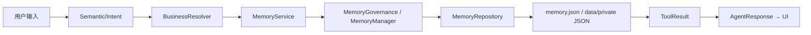
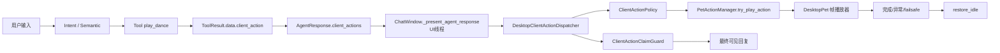
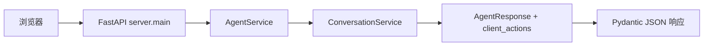

# RoxyPlan 真实运行调用链（V1.8.3）

## 默认唯一决策链

```mermaid
flowchart LR
    U["用户消息"] --> S["InteractionStateCoordinator"]
    S --> D["IntentRouter：仅确定性内部路由"]
    D --> F["LocalFeatureExtractor"]
    F --> P["SemanticActionParser：唯一公开语义入口"]
    P --> B["BusinessResolver：真实对象/ID"]
    B --> A["AgentPlanner：只规划已解析动作"]
    A --> V["ActionPreview / Confirmation"]
    V --> X["ActionBatch / ToolExecutor"]
    X --> R["ToolResult / ClientAction"]
    R --> C["ResponseComposer + ClaimGuard"]
    C --> UI["桌面或 Local Web"]
```

默认主链不会让 LLMPlanner 重新解释标记为 `semantic_authoritative` 的原始文本。原生 tool_calls 和 JSON fallback 都先转成 ActionCandidate；模型输出不是执行授权。

## A. 普通聊天

```mermaid
flowchart LR
    U["用户输入"] --> UI["ChatWindow.send_message\nUI线程"]
    UI --> P["ConversationService.prepare\n普通Python"]
    P --> R["IntentRouter / SemanticActionParser"]
    R -->|chat| Q["ChatReplyWorker\nQThread"]
    Q --> C["ConversationService.complete"]
    C --> L["RoutedLLMClient\n模型/网络"]
    L --> AR["AgentResponse"]
    AR --> F["finish_ai_reply\nUI线程"]
    F --> D["先派发 client_actions（通常为空）"]
    D --> V["渲染消息"]
```

- 异步边界：模型请求位于 QThread；Qt 渲染回到 UI 线程。
- 文件读写：上下文可读取聊天历史、相关记忆和知识；回复记录经 Repository 原子写入。
- 错误处理：Provider 归一化/降级，ConversationService 生成安全 fallback。
- 回复来源：模型文本经 sanitizer 和 ResponseComposer/Guard 校验。

## B. 计划操作

```mermaid
flowchart LR
    U["用户输入"] --> S["SemanticActionParser"]
    S --> B["BusinessResolver"]
    B --> A["AgentCore"]
    A --> T["ToolExecutor"]
    T --> R["ToolRegistry"]
    R --> P["PlanService / GrowthManager"]
    P --> J["LocalJsonGrowthRepository"]
    J --> TR["ToolResult + 后置校验"]
    TR --> RC["ResponseComposer"]
    RC --> UI["AgentResponse → UI"]
```

- 全链普通 Python；无 Qt、无模型直写。
- 写入位置：`data/private/today_plan.json` 等。
- 错误位置：参数/安全/确认在 ToolExecutor，真实对象和后置条件在 Resolver/Service/Registry。

## C. 记忆操作

- 候选确认后才写长期记忆；模型不能直接写 JSON。
- 错误和冲突由 MemoryService 返回结构化结果，UI 不猜测成功。

## D. 桌宠动作（统一链）

- ToolRegistry 不再调用 `start_dance()`，因此 Agent/QThread 不持有或触碰 Qt。
- Dispatcher 先执行，回复后显示；不等待整段舞蹈完成，只要求 accepted/running。
- busy 策略：拒绝第二段并返回 `skipped_busy`，不排队。
- 去重：同一 action_id/idempotency_key 在 30 秒窗口内只消费一次；新的用户轮次产生新 ID，不按动作名永久去重。
- 状态释放：正常帧结束、异常、取消和 30 秒 failsafe 最终都回到 idle。

## E. 固定命令与桌面菜单

- `ChatWindow.handle_dance_command` 仅作为兼容 wrapper，生成与 Agent 相同的 `ClientAction(play_dance)`，不直接调用窗口。
- 桌宠右键菜单生成 `ClientAction(source=desktop_menu)`，通过同一个 Dispatcher。
- `DesktopPet.start_dance` 和 `execute_client_action` 是兼容 wrapper，内部仍委托 Dispatcher，不构成独立执行入口。

## F. Local Web

- Web 能保留并返回 `client_actions` 字段。
- 服务端不执行 PySide6 动画；动作是客户端声明，只有桌面 Dispatcher 有执行能力。
- 当前 Web 页面不是桌宠动画客户端，因此应展示文本/忽略不支持的动作，不得在服务端伪造执行凭证。
