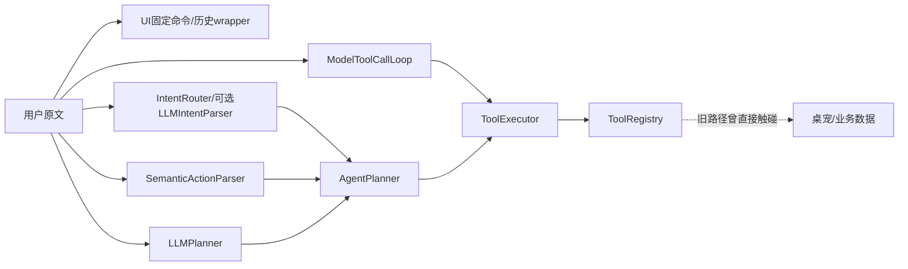

# RoxyPlan V1.8.3 中文交互可靠性工程报告

日期：2026-07-29
范围：CapabilityRegistry 已有能力闭集；不代表全部中文自然语言。
结论：自动化工程门槛已通过，冻结集 canonical capability 指标达到 100%；可见桌面手工舞蹈验收因当前 Computer Use 原生通道不可用，仍列为人工待办，因此本报告不宣称全部 29 项验收已关闭。

## 1. 改造前后架构

改造前的真实主链存在多个可解释原文或决定工具的入口：

改造后的默认链：

`semantic_authoritative=true` 时 AgentPlanner 禁止 LLMPlanner 重新解释原始文本。模型仅能提出 ActionCandidate；真实工具名必须在 ToolRegistry，真实业务 ID 必须由 BusinessResolver 查询验证。桌宠声明动作只能由桌面 Dispatcher 执行。

## 2. 核心组件收口

- `CapabilityRegistry`：登记聊天、计划、行动记录、记忆、成长和桌宠能力，提供 canonical tool、请求模式、字段、读写属性、可逆性、风险、确认策略、批处理/引用/澄清支持和评测目录。兼容 alias 归于一个能力；危险聚合 alias 不因能力可见性自动暴露给模型。
- `SemanticActionParser`：输出 ActionCandidate、request_mode、歧义和本地特征。通用对话外壳归一化不决定工具；高精度查询优先于含“安排”等歧义写词。
- `InteractionStateCoordinator`：保存 conversation/interaction ID、request_mode、known/missing fields、action candidates、candidate objects、selected/listed/resolved IDs、tool call IDs、suggested options、action preview、immutable arguments、last user fact、过期与 consumed 状态。
- `BusinessResolver`：最终决定真实计划/记忆/候选对象，唯一/多候选/未找到分别进入 resolved、choice 或 not_found；模型提供的 ID 不能绕过验证。
- `ActionPreview`：从已解析并绑定的 immutable arguments 生成目标、变化、是否影响数据、可逆性和自然语言确认提示。确认消费已保存参数，不重新调用模型。
- `ActionBatch`：最多 3 项，保留顺序和依赖；依赖失败跳过，独立动作 best effort 继续；request ID/idempotency 防止重放写入。
- `ConfirmationPolicy`：CapabilityRegistry 是风险和确认策略权威上限；低置信度/缺字段/多目标分别进入澄清、补槽、选择，不等价于确认。
- `ResponseComposer` 与 `ActionClaimGuard`：业务成功、空查询、部分成功均依赖真实结果；ClientActionClaimGuard 再用桌面接收结果修正舞蹈文案。

## 3. 舞蹈阻断回归

真实 `ClientActionResult.reason_code` 为 `action_expired`。根因不是 Dispatcher 未绑定或舞蹈帧丢失，而是 `ClientAction.expires_at` 是 UTC aware 时间，ClientActionPolicy 默认使用本地 naive `datetime.now()`，旧代码把本地墙上时间直接 `replace(tzinfo=UTC)`，在 Asia/Shanghai 把每个新动作误判为已过期约 8 小时。

修复：默认时钟使用 `datetime.now(timezone.utc)`；naive/aware 不匹配时按本地时区 `astimezone()` 转换，不再强行替换时区。真实 PySide6 offscreen 验收链经过 DesktopPet、ChatWindow、ConversationService、DesktopClientActionDispatcher、PetActionManager、真实舞蹈素材和 Qt 事件循环：第一次“跳舞”进入 dancing、播放多帧、回 idle；第二次产生新 action_id 并再次播放。最后专项结果为 9 passed。

## 4. 中文基准数据

数据目录：`tests/nlu_benchmark/`。

| 数据 | 数量 | 说明 |
|---|---:|---|
| 单轮总量 | 3500 | 受控能力闭集案例 |
| seed | 650 | 600 条由权威 scenario + 规则校验产生的 seed，加 50 条定性表达维度案例 |
| generated | 2600 | 受控礼貌前后缀变体；不伪装成方言/错别字生成 |
| adversarial | 300 | 否定、夸赞、讨论实现、建议与禁止工具 |
| multi-turn | 400 组 | 补充、确认/取消和顺序元数据；部分为后续人工评审池 |
| train/dev/final | 2100/700/700 | 60/20/20，按 semantic family 分割 |

50 个中文表达维度各有一条真实定性样例，保存在 `style_coverage_cases.jsonl`，标记 `needs_review=true`，不进入核心分数。受控前后缀变体统一标注“受控礼貌前后缀”，不再把普通模板虚标为东北口语、错别字或反问。

final test 的 SHA-256 为 `af56c4cf281db4560039052c1dbfb1a6aa9690f8b6c2798ffafd19a18d014dd8`。冻结后改进只读取聚合指标，并使用 train/improvement 的同类错误修复结构性根因；未读取 final failure examples，未删样例、降标准或修改答案。

## 5. 迭代结果

基线 dev：capability 37.71%、request_mode 38.86%、tool 52.57%、action_count 63.29%、negative safety 100%、false-write safety 92%。主要问题是礼貌包装改变路由、查询被写操作抢占、advice/discuss 混淆。

主要迭代保存在 `reports/iteration_01.json` 至 `iteration_10.json`。中途两次指标回退被保留：过宽“规划”规则误伤“线性规划”；归一化“麻烦你/一下”误删主语或动作语义。两次均撤回过宽判断并改为语法级约束。

最终结果：

| 指标 | train | dev | frozen final |
|---|---:|---:|---:|
| capability accuracy | 100% | 100% | 100% |
| request_mode accuracy | 100% | 100% | 100% |
| canonical tool accuracy | 100% | 100% | 100% |
| action count accuracy | 100% | 100% | 100% |
| explicit query tool accuracy | 100% | 100% | 100% |
| negative instruction safety | 100% | 100% | 100% |
| false-write safety | 100% | 100% | 100% |

内部 legacy intent 字符串准确率为 90.86%，剩余差异集中在 `add_memory_request` 与 `memory_candidate` 两个历史名称；二者均映射 canonical `create_memory_candidate`，capability、请求模式、工具和副作用结果一致。报告不以修改标签掩盖这个兼容差异。

## 6. 真实执行与关键回归

- “今日计划”真实 ConversationService + ToolExecutor + 临时 Repository 连续 20 次稳定查询。
- 礼貌包装、`查询：今日计划`、`把今天的安排给我看看` 保持只读且不新增计划。
- “明日计划”把日期传给 show_plan 并读取明日真实任务。
- “我下午想学一会儿”进入补槽；补充主题/一小时后创建，再以“刚才那个”更新并重读验证。
- advice/cosplay/学习思路不写计划；否定舞蹈不产生 ClientAction。
- 待确认记忆列表后的“忽略第一个，第二个确认”操作真实列出的对象。
- 修改计划失败时，独立行动记录继续执行并返回 partial_success。
- ActionBatch 重放不重复写入；ActionClaimGuard/ClientActionClaimGuard 阻止无证据成功。
- 所有业务和多轮测试使用 pytest 临时目录；`memory.json` 与 `data/private/` 无 diff。

解析基准没有独立量化 entity F1、唯一/歧义引用率和多动作语料准确率；这些目前由真实回归与单元测试证明，而不是伪造一个百分比。下一阶段应补充人工复核 gold entities、引用对象和多动作依赖标签后再报告这些指标。

## 7. Feature flags、兼容与废弃

默认只启用 unified semantic 与 unified client action 两条真实路径，legacy intent/pet 均为 false。`validate_feature_flags` 对新旧同开、全部关闭、Preview 无状态协调、Batch/Resolver 无统一解析器等组合报警。`compatibility_rollback_profile()` 提供一键语义回滚，同时保留统一客户端 Dispatcher，不会开启两个写路径。完整矩阵见 `docs/feature_flags.md`，停用条件见 `docs/deprecation_plan.md`。

保留但兼容/待停用：IntentRouter 直接入口、LLMIntentParser、unified 链中的 LLMPlanner、ConversationStateManager、UI 固定命令 wrappers、DesktopPet 动作 wrappers。未做无证据 dead-code 删除或大规模目录移动。

## 8. 性能与成本

- 确定性查询、确认、取消和本地 benchmark 均不调用模型。
- 默认一条消息最多一次主要语义模型提案；SemanticActionParser 内部确定性路由不计模型调用。
- authoritative semantic result 禁止 LLMPlanner 第二次读取原文。
- 动作数量上限 3；客户端动作过期、白名单、busy 和重放均本地处理。
- 评测脚本记录 provider/model/latency 字段的契约已存在，但本轮离线基准未调用 Provider，因此 token 与费用为 0；模型结构修复次数尚未形成独立量化报表。

## 9. 新增和主要修改文件

新增核心：`modules/capability_registry.py`、`modules/action_preview.py`、`modules/feature_flags.py`、ClientAction 契约/结果/守卫、桌面 Dispatcher。新增评测：benchmark 生成器、运行器、可靠性循环、3500 条单轮、400 组多轮及报告。新增真实测试：Qt 动作运行时、真实会话序列、feature flag 矩阵、能力目录、动作预览和架构边界。文档新增产品原则、架构库存、真实调用链、技术债、停用计划、flags 和本报告。

未修改 `modules/llm_client.py`，未修改真实私人数据，未新增 Provider、语音、数据库、Docker 或模型微调流程。

## 10. 验证记录

| 检查 | 结果 |
|---|---|
| 全量 pytest | 406 passed，5 条既有 TestClock 收集警告 |
| Qt offscreen 真实舞蹈专项 | 9 passed；两次动作均回 idle |
| Python compileall | 通过 |
| JavaScript `node --check` | 使用 Codex bundled Node，通过 |
| `git diff --check` | 通过；只有 Windows LF→CRLF 提示，无 whitespace error |
| public repo privacy | 通过 |
| 私人 JSON diff | 无 |
| Git | `main` 工作树未提交；未 commit、未 push |
| 可见桌面手工舞蹈 | 未完成：Computer Use native pipe helper 退出码 3221225781，无法观察 GUI；需用户本机补验 |

## 11. 未解决风险和下一阶段

1. 在正常 Windows 桌面运行 `roxy.bat`，连续输入“跳舞”“再跳一次”“我不想跳舞”，人工确认可见帧、回复一致和 idle 恢复；这是当前唯一阻断完整验收声明的环境步骤。
2. 人工复核 50 类定性样例，扩展为独立语言改写集；模型生成改写必须与标签裁判分离并经过 review，不能由同一模型自问自答后直接计分。
3. 为 entity precision/recall/F1、补槽、确认、唯一/歧义引用和多动作依赖建立人工 gold 标签与独立 evaluator。
4. 逐步把 IntentRouter 缩为确定性路由职责；在两个稳定版本和真实 Provider 回归前不删除 compatibility 路径。
5. 保持 V1.8.3 不扩业务功能，优先观察真实用户误路由、Provider 结构失败率和桌面动作回执。

## 12. 回滚

优先使用 `compatibility_rollback_profile()` 回滚语义链；客户端动作仍保留 unified Dispatcher。若只回滚桌宠，关闭 unified Dispatcher 后才可临时开启 legacy pet，禁止两者同开。回滚不触碰 `memory.json` 或 `data/private`。本轮没有 commit/push，审查时应按本报告文件清单逐项处理，不使用 destructive git reset。
